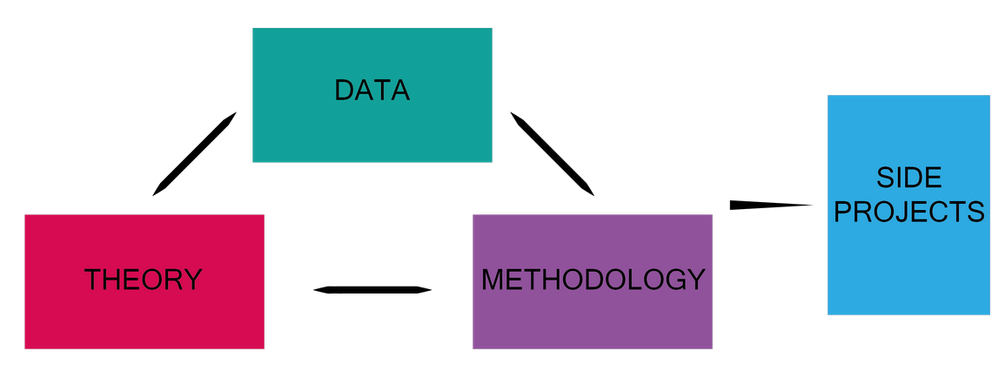
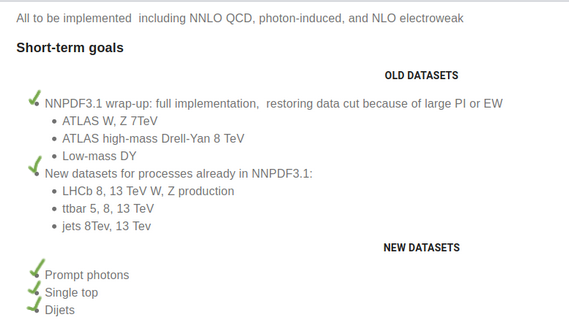
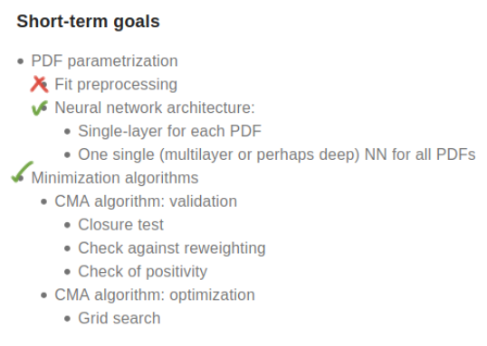

## Organization

The NNPDF work is organized in 3 + 1 parts:

@---

## Data

The **data** tasks consist mainly in implementing the theory predictions' tables to
compare the PDF fit to the experimental datasets available.

@---

## Theory

The **theory** job consist not only in studying the theoretical properties of
the PDF and pQCD (mainly done by the single groups)

but especially in _implementing the software_ to make the **predictions** available
for the fit.

@---

## Methodology

The **methodology** is the hood for anything related to the fit:

  

    <ul>
      <li>
      new ML methods and techniques
      </li>
      <li>
      managing physical constraints
      </li>
      <li>
      asses the <em>quality of fit</em> through tests
      </li>
    </ul>
  

  

