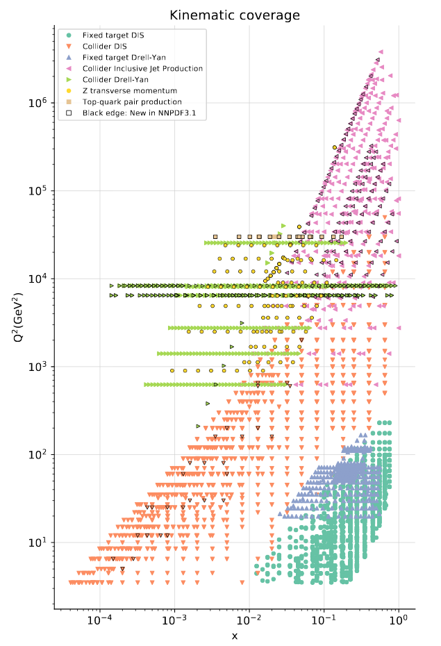

## Dataset

  
  

    

      The data-set related to the last released version (NNPDF 3.1) was mainly
      dominated by 2 sources:
    

    <dl>
      <dt style="font-size: 0.8em">HERA</dt>
      <dd style="font-size: 0.6em">
      They are <strong>DIS</strong> data, and therefore a clean probe of proton
      constituents, historically the most relevant.
      </dd>
      <dt style="font-size: 0.8em">LHC</dt>
      <dd style="font-size: 0.6em">
      They are hadronic events, involving two partons at a time. The data
      abundance still makes them very relevant.
      </dd>
    </dl>
    

      Which one will dominate the next PDF generation it's an open question.
    

  

