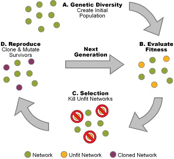

## Genetic Algorithm 🧬

  

    

      The genetic algorithm consists in:
    

    <ol style="list-style-type: upper-latin">
      <li>
        generating a random initial population in the parameter space
      </li>
      <li>
        <strong>evaluation:</strong> evaluate the loss function on all the elements
      </li>
      <li>
        <strong>selection:</strong> select the most fitting elements
      </li>
      <li>
        <strong>mutation:</strong> reproduce, mixing the survivors' features
      </li>
    </ol>
    
The main advantage of this method is that guarantees a better 
    <em>global exploration</em> of the parameter space.

  

  

  
  
  

@---

## Nodal Genetic Algorithm

In NNPDF3.0 the collaboration discovered that it was better to consistently mutate
a group of weights, rather than optimizing a single one at a time (as it was
done before):

> employing coherent mutations across the whole network architecture instead
> leads to improved fitting performance [...] related by the structure of the
> network

  In practice each node was assigned a probability to mutate, and if a node is
  selected all the parameters that are related to the node are mutated.

  The mutation size is random for each mutant, modulated by a parameter and the
  number of generations:
  $$
  w \to w + \frac{\eta r_\delta}{N_{\text{ite}}^{r_{\text{ite}}}}
  $$

