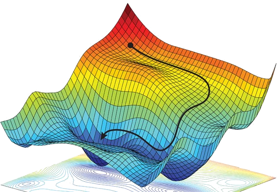

## Gradient descent

  The usual algorithm applied by the <em>ML community</em> (especially for deep
  learning) is instead the familiar gradient descent, extended to the neural
  network applying the so-called <strong>back-propagation</strong>.

@---

## Back propagation

I'm not going into the details, but for a physicist should be enough to know
that it is just a fancy name for the **chain-rule**.

