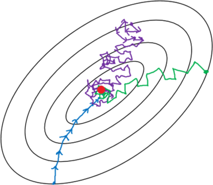

## SGD

There are multiple alternatives related to **GD**:

  

    <dl style="font-size: 0.7em">
      <dt>classic</dt>
      <dd>in order to compute the real gradient you need to compute the loss on the
      <strong>full</strong> dataset, <em>it is expensive</em></dd>
      <dt>mini-batches</dt>
      <dd>you can decide to evaluate the loss only on a small subset per iteration,
      a <strong>mini-batch</strong>, assuming it is representative on average</dd>
      <dt>stochastic</dt>
      <dd>limit of mini-batches of size $1$</dd>
    </dl>
  

  

    
  

In the last two cases the full dataset is explored in multiple steps, and
a full iteration is called an <strong>epoch</strong>.

@---

## Even more kinds of GD

