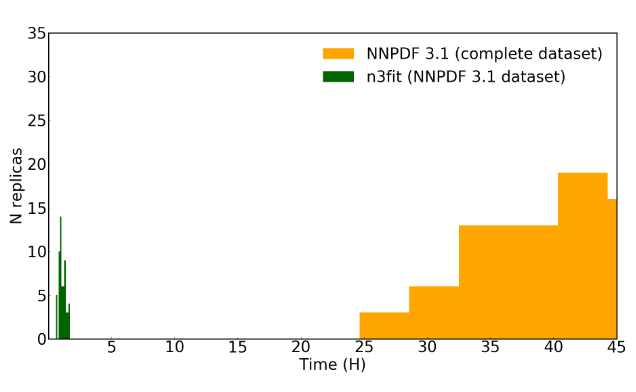

## Performance

The main success of **SGD** is the performance obtained. But why performances
are so relevant?

  
  

    

      The reason is that if we can make more iterations, and furthermore
      <strong> more fits</strong>
    

    <ul>
      <li>used for <em>phenomenological studies</em></li>
      <li>used for <em>hyperparameters search</em></li>
    </ul>
  

Before diving in _hyperopt_ let's introduce at the same time another feature,
and an actual _hyperparameter_.
