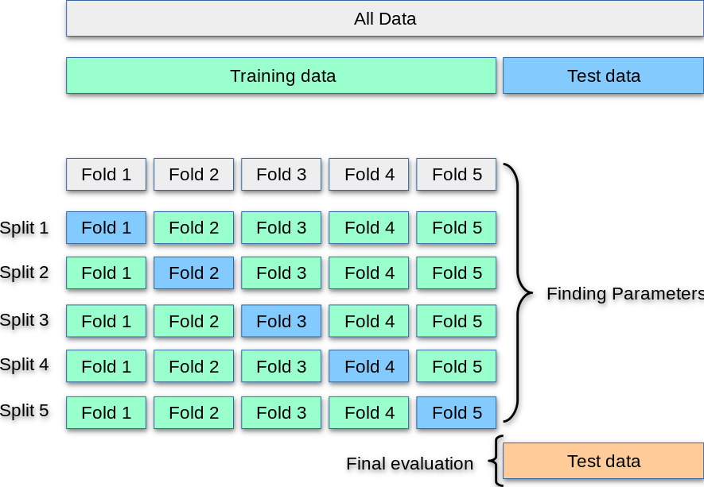

## K-folding

  

    
  

  

    

      If actually we are going to obtain a poor split, a solution is to <em>recycle</em>
      data: it is caled <strong>k-folding</strong>.
    

  

  

    

      This can be done at a nested level, for both:
      <ul>
        <li>training-validation pair</li>
        <li>anything-test pair</li>
      </ul>
    

  

  

    
  

