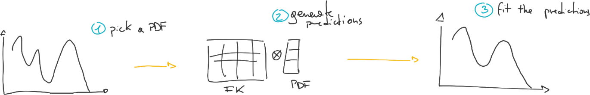

## Closure tests

  

    
  

  

    

    The <strong class="txtclr green">solution</strong> is to create our <em>
    fake data</em> from a <em class="txtclr blue">known physics</em>, and then
    fit it (pretend not to know).
    

    

    
      Do you know any <em>physics</em>?
    
    

  

  We are using theory to generate $\sigma_{h, cl}$, instead of using
  $\sigma_{h,exp}$, who come from an unknown
  nature-made <strong>proton</strong>.

