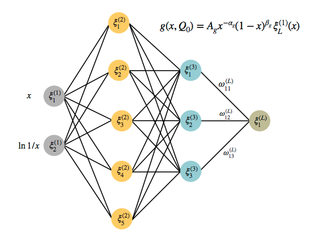

## Neural Network

  

    <strong>Deep feedforward networks</strong>, or <strong>multilayer perceptrons</strong> (MLPs),
    are the quintessential deep learning models.
  

  

    The goal is to approximate some function $f^*$.
  

I. Goodfellow, Y. Bengio, A. Courville

  
  

    
In our case the function to approximate it's exactly the PDF

    

      $$
      f_i(x,Q^2)
      $$
    

  

