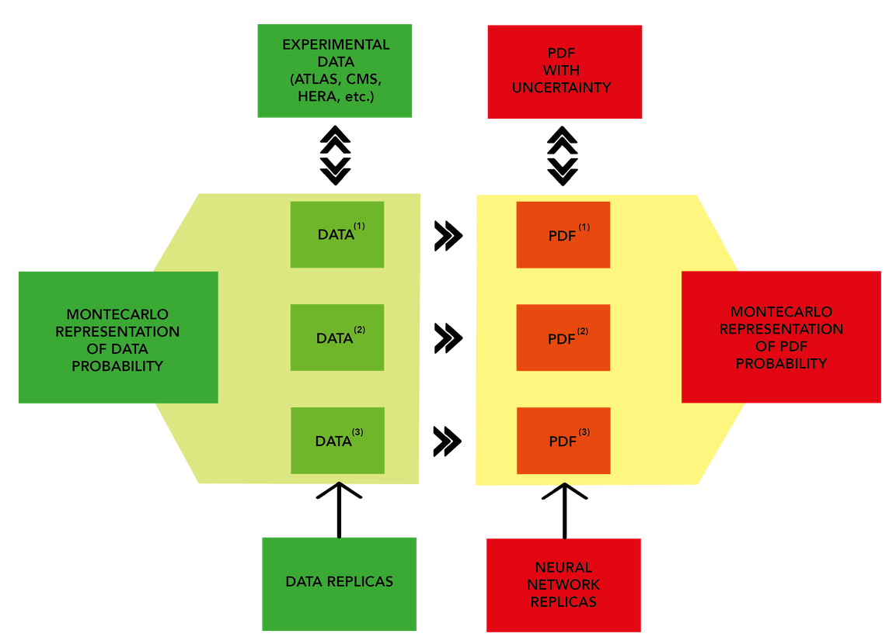

## Monte Carlo replicas

The proposal was to completely replace the Hessian approach with a Monte Carlo
based one.

In this way not only the error is generated, but a sample representing the full
distribution.

  While gaussianity is assumed for experimental data.

