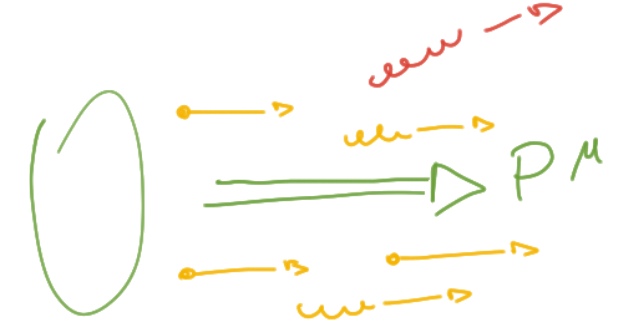

## Collinear contributions

We have included the collinear contributions into the PDF, but so:

  we are allowing proton constituents to mutate into each other with the Feynman
  vertices

In particular we are looking only to collinear part, so everything the splits
non-collinearly it's then lost in our proton definition.

  it's not included in the PDF, so it'll be considered as a part of the hard
  process, it is the <em>ISR</em>

