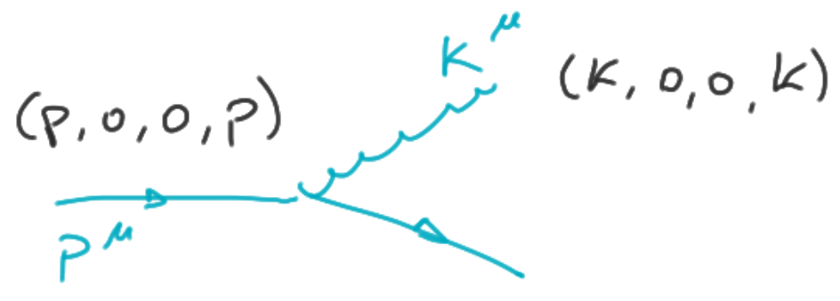

## Splitting structure

So we are interested in how the splitting modifies the structure we are
initially given. A single splitting diagram may look like:

_Again:_ pay attention that only the collinear part of this diagram it's
contributing to the redefinition of the structure, i.e. only the region where
$k^\mu \simeq \alpha p^\mu$ is involved.
