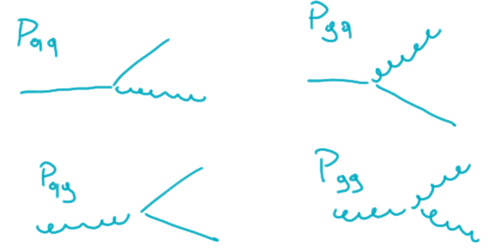

## Splitting functions

This contributions are then the divergent (+ finite, according to $\mathcal{F}$)
part we computed in our diagrams.

Until it is regulated in any way this object may still be computed in the
<em>regular perturbation theory</em>.

  
  

    

    They are the so called:
    

    

    <strong><em>Altarelli-Parisi</em> splitting functions</strong>.
    

  

