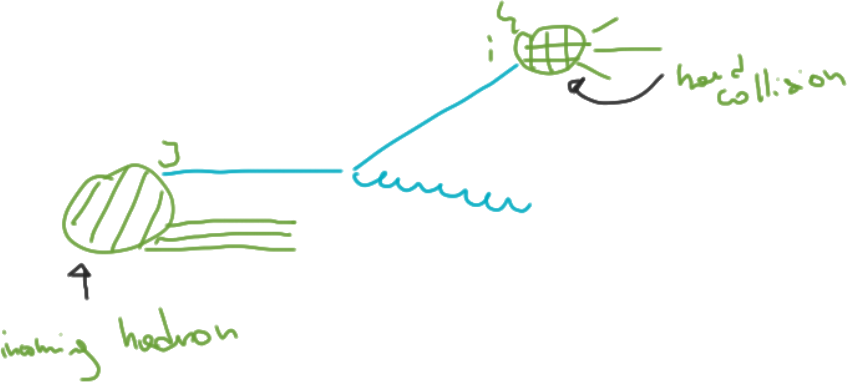

## DGLAP equation

Finally we obtained our DGLAP evolution equation:

$$
\frac{\partial}{\partial \log\mu_F^2} f_i(z, \mu_F^2) = \left[
\frac{\alpha_s}{2\pi} P_{ij}(z)
\otimes f_j
\right](z, \mu_F^2)
$$

@---

## DGLAP and Unphysical scale

A cleaner way of obtaining the DGLAP equation is to derive the factorization
formula by $\frac{\partial}{\partial \log\mu_F^2}$.

Indeed the **physical observables** (like DIS structure functions, or any kind
of hadronic cross sections) **do not depend on the unphysical scale** $\mu_F^2$,
while the dependence in the ingredients has been introduced by our redefinition,
reshuffling bits from the partonic cross section to the PDF.

This procedure it's similar to what is done to obtain the _Callan-Symanzik_
equation, in the context of UV renormalization.
