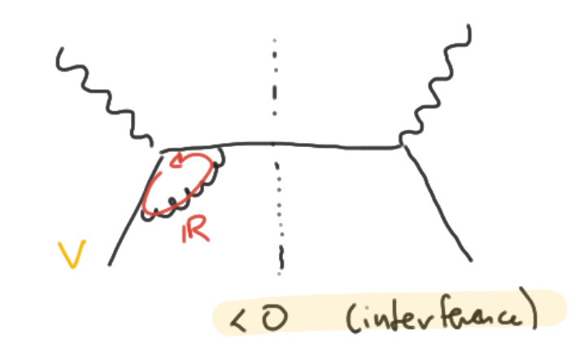

### Soft divergences:

## real-virtual cancellation

Nor the soft bremsstrahlung neither the pure virtual correction may be observed
separately.

  
  

For this reason they always comes in pair: _when the photon it's soft cannot be
so much off-shell_.

  so in the soft limit a real photon it's not so different from a virtual one

@---

## Theorem

There is a theorem, by _Block_ and _Nordsieck_ for QED, than generalized to SM
by _Kinoshita_, _Lee_, and _Nauenberg_ (**KLN** theorem), that proves:

  the cancellation of soft divergences between real and virtual contributions to
  all orders in pQFT

  <h5 style="font-size: 1.3em">
    The necessity for an IR cutoff
  </h5>
  
  All the physical observable should be cutoff in the IR anyway. Indeed the
  **number** of soft radiated photons in a collision is divergent even in the
  classical EM theory.
  
  But the energy emitted by photons below a given frequency it's still a finite
  quantity.

