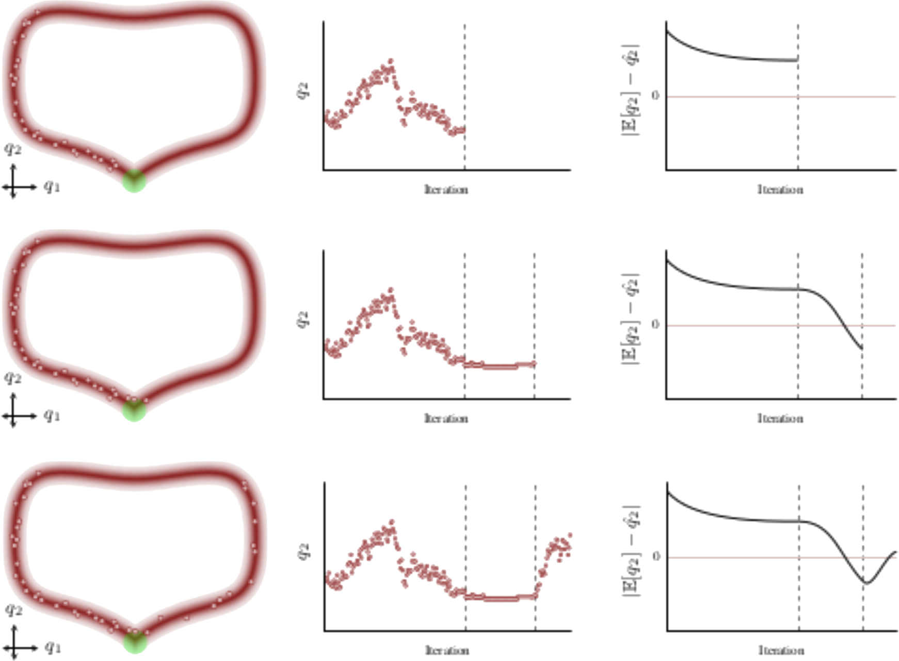

## Pathologies

Most chains are not able to resolve <em class="txtclr blue">tiny details</em> of
the typical set, that might contain <em class="txtclr yellow">significant density</em>.

But the chain is <em>analytically</em> proved to be <strong class="txtclr
green">asymptotically correct</strong>.

Then it compensate spending more time near the <em class="txtclr
blue">boundary</em> of the typical set.

This causes oscillatory behavior &rarr;
highly <em class="txtclr red">increase converge time</em>.

@---

## Analyze pathologies

Various consideration can be done about pathologies.

#### Geometric ergodicity

This property guarantees ideal behaviour

&cross; it's hard to prove for a generic model

#### Detection

Empirical statistics can be used as diagnostics for pathologies, e.g. split
$\hat{R} \sim 1$.
