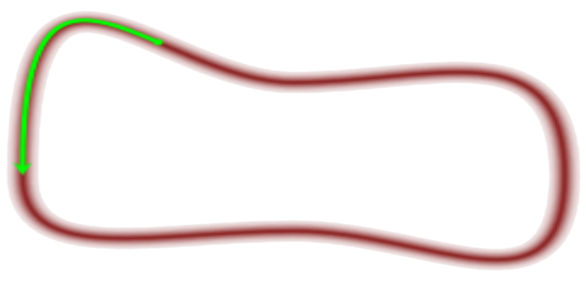
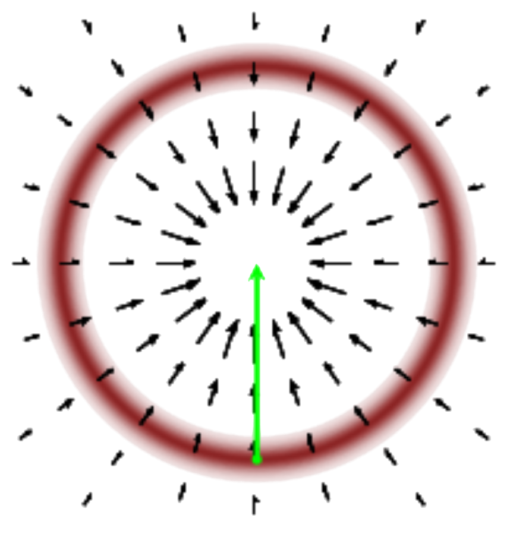

## Optimized steps

Then the solution looks obvious:

<em>big steps <strong class="txtclr green">inside</strong> the set!</em>

So we need to exploit the geometric information: a vector-field

    

        
        
<em class="txtclr green">needed</em>: longitudinal

    

    

        
        
<em class="txtclr blue">available</em>: gradient

    

