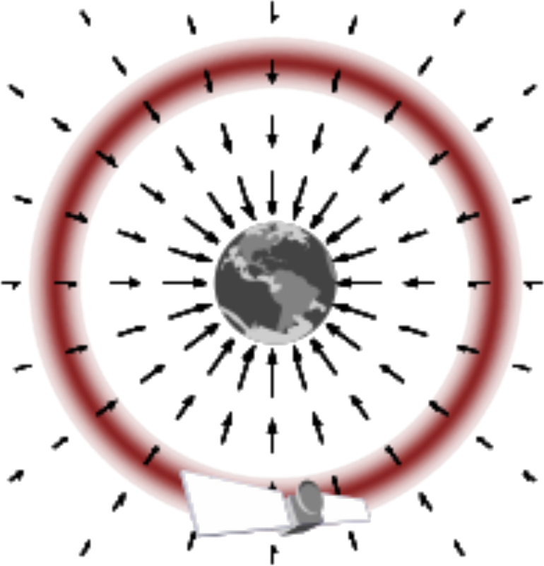
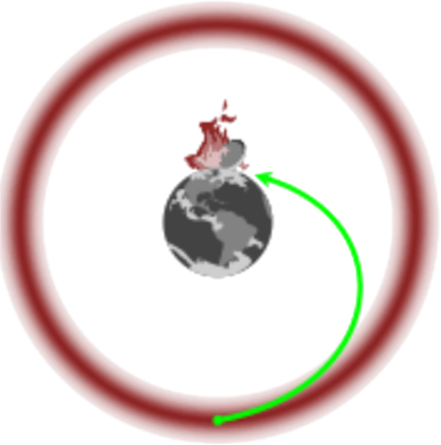
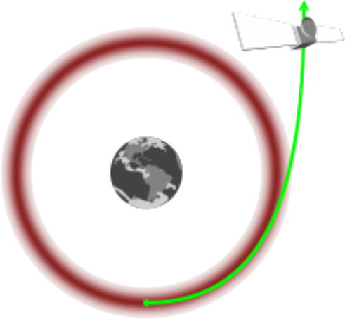

## Information extraction

Here a <strong class="txtclr blue">big step</strong> is required, the best way
is to pick the correct analogy: <strong class="hlight blue">classical
physics</strong>

&rarr;

A new ingredient arise: <strong class="hlight green">momentum</strong> plays an important role

free fall

still fall

escape

