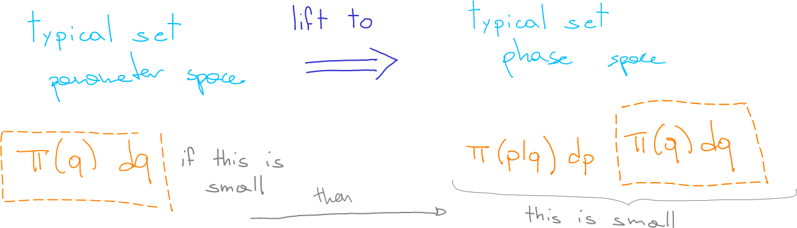

## Towards Phase Space

To add momentum we need to promote both our space and distribution:

$$\{q\}, ~\pi(q) \qquad\rightarrow\qquad \{(q,p)\}, ~\pi(q,p)$$

The <em class="txtclr blue">canonical distribution</em> $\pi(q,p)$ is obtained
from the <em>target distribution</em> adding the missing information: $\pi(q,p)
\equiv \pi(p|q)\pi(q)$.

