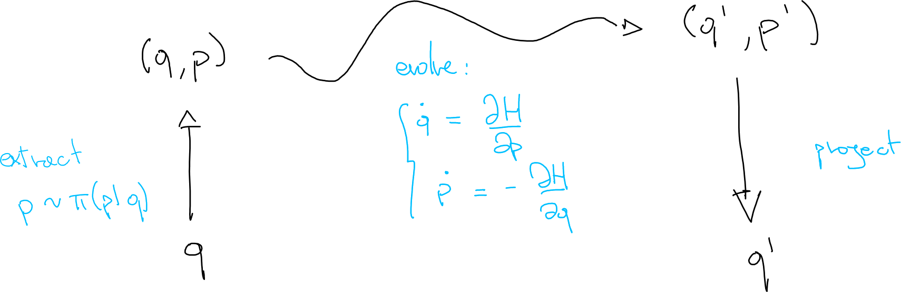

## Evolution

The gradient of the target distribution is now encoded in the gradient of the potential energy.

It is now possible to apply Hamilton's equations to evolve.

$$
\begin{aligned}
\frac{\mathrm{d}q}{\mathrm{d} t} &= + \frac{\partial H}{\partial p} = \frac{\partial K}{\partial p} \\ \frac{\mathrm{d}p}{\mathrm{d} t} &= - \frac{\partial H}{\partial q} = - \frac{\partial K}{\partial q} - \frac{\partial V}{\partial q}
\end{aligned}
$$

Last step is the actual momentum introduction:

