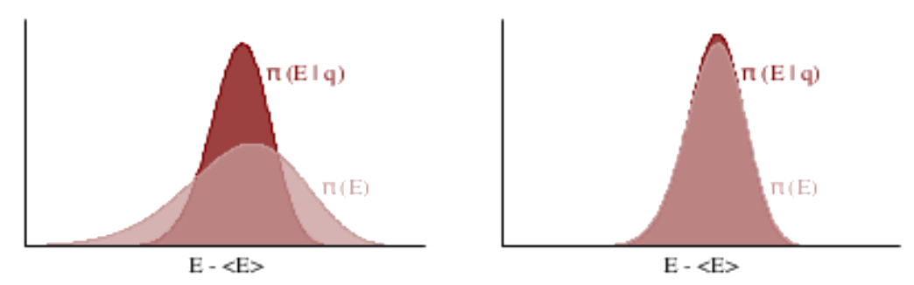

## Exploration

<ol style="list-style-type:upper-latin">
<li><em>random</em> set extraction</li>
<li><em>deterministic</em> set evolution</li>
</ol>

<ol style="list-style-type:upper-latin">
<li>the energy extraction should sample the <em
class="txtclr blue">marginal energy distribution</em></li>
</ol>

<ol style="list-style-type:upper-latin" start="2">
<li>evolution cost proportional to $\tau$, exploration monotonic in $\tau$</li>
</ol>

trade-off &rarr; optimal $\tau$

