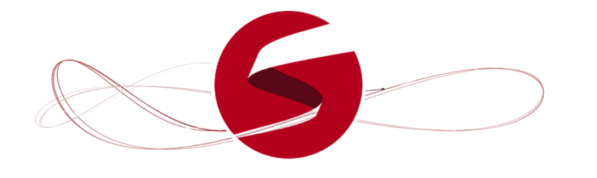

## Implementations

Here a couple of relevant implementation, mainly of NUTS:

<h5 style="align-self: center; text-align: left; margin: 0">
Stan
<a href="https://mc-stan.org/" style="text-transform: initial; font-weight:
normal; font-size: 0.7em">https://mc-stan.org/</a>
</h5>

a powerful and generic platform for statistical modeling

<ul style="font-size: 0.9em">
<li>"full Bayesian statistical inference with MCMC sampling <em class="txtclr grey">(NUTS, HMC)</em>"</li>
</ul>

<em class="txtclr grey">interfaces available for multiple languages and platforms</em>

<h5 style="align-self: center; text-align: left; margin: 0">
PyMC3
<a href="https://docs.pymc.io/" style="text-transform: initial; font-weight:
normal; font-size: 0.7em">https://docs.pymc.io/</a>
</h5>

a python only library for Bayesian statistics, also implementing <em
class="txtclr grey">NUTS</em> and <em class="txtclr grey">HMC</em>

@---

## Implementations (HEP)

<h5 style="align-self: center; text-align: left; margin: 0">
BAT
<a href="https://github.com/bat/bat" style="text-transform: initial; font-weight:
normal; font-size: 0.7em">https://github.com/bat/bat</a>
</h5>

<em class="txtclr grey">Specific research fields</em> have developed their
bayesian analysis framework, particularly <em class="txtclr grey">optimized for
their needs</em> and applications.

Some <em class="txtclr grey">particle physicists</em> did the same, in order to
integrate with the existing environment, and deployed as <em class="txtclr
grey">C++ library</em>.

<h5 style="align-self: center; text-align: left; margin: 0; text-transform: initial">
BAT.jl
<a href="https://github.com/bat/BAT.jl" style="text-transform: initial; font-weight:
normal; font-size: 0.7em">https://github.com/bat/BAT.jl</a>
</h5>

The modern <em class="txtclr grey">reincarnation</em> of the former one, now
written in <em class="txtclr grey">Julia</em>.

