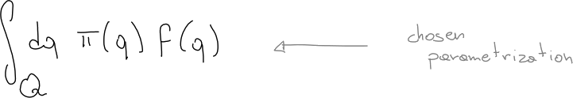

---
---

## The problem

In order to study probability models a _single_ operation is required:
evaluating expectation values:

In general this involve evaluating integrals&dagger;:

but there is no general way to do it analytically.

    &dagger; sums for discrete distributions

