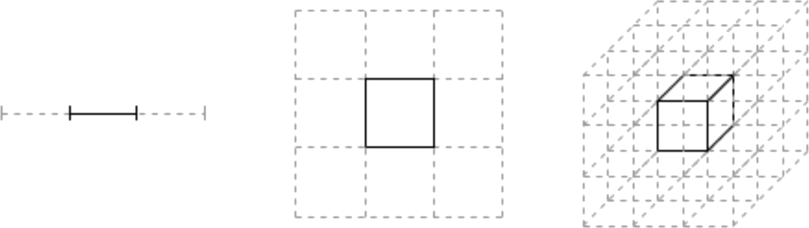

## Space volume

The mode neighborhood is a _poor choice_ because
the main ingredients are **two**:

<ol>
    <li>the probability density (integration kernel, <em>part of</em>1)</li>
    <li>the space volume (integration measure)</li>
</ol>

    

    Since usual densities has strong <em class="txtclr yellow">radial</em>
    dependency2 the volume becomes
    more and more relevant in higher
    dimension.
    

    

    It has the effect of enhancing the tails
    contribution.
    

    

    

    1 even the specific function is part of the kernel 
    2 they are relevant in a compact set

