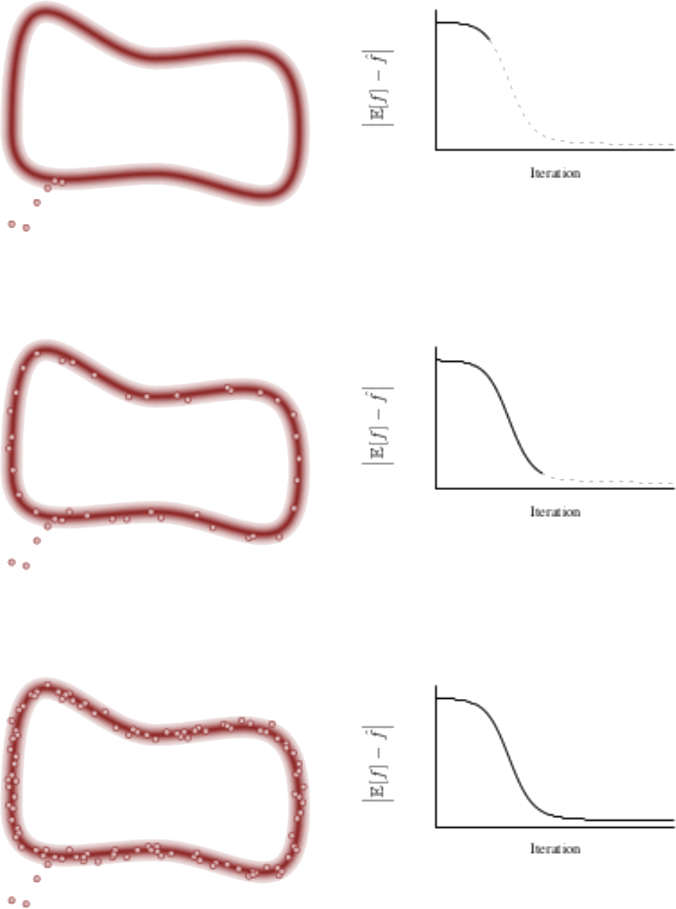

## Ideal Picture

The sampling happens in 3 phases:
<ol>
    <li>
        
converges to typical set

        <ul>
            <li style="color: gray">biased estimator</li>
        </ul>
    </li>
    <li>
        
first typical set exploration

        <ul>
            <li style="color: gray">fast convergence</li>
        </ul>
    </li>
    <li>
        
subsequent explorations

        <ul>
            <li style="color: gray">slow improvement & plateau</li>
        </ul>
    </li>
</ol>

In order to compute the variance the
autocorrelation has to be taken into account,
_effective sample size (EFF)_.
