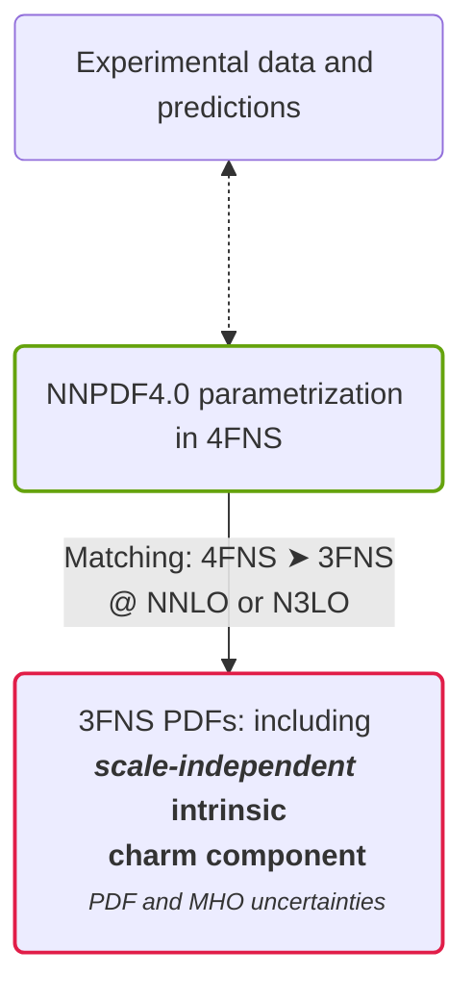

# Charm nel protone

Pesante ma presente

  <cite-arxiv aref="2208.08372" right="0" class="relative"/>

<template #col-1>

Una componente di  **charm** nel protone non è una novità, dato che viene
generato dall'evoluzione perturbativa secondo le equazioni DGLAP, in uno schema
con 4 o più flavor (per produzione di coppie dal gluone).

Ma è anche possibile ottenere un quark charm da una sorgente differente:

- **perturbativa**: generata dall'evoluzione DGLAP
- **intrinseca**: generata dalla dinamica non perturbativa
- **estratta**: rilevata nel risultato di una determinazione dai dati

</template>
<template #col-2>

  <video autoplay loop muted w="4/5" h="2/3" p="2" rounded="4"
    bg="black" shadow="~ dark">
    <source src="split.mp4" type="video/mp4">
  </video>

La componente charm nel fit <b>NNPDF4.0</b> non è direttamente *intrinseca*,
dato che viene scelto di eseguirlo in uno schema a 4 flavor (4FNS).

</template>

---
layout: cols
---

# Unveiling the intrinsic component

<template #col-1>

</template>
<template #col-2>

The **Operator Matrix Element (OME)** $\mathbf{A}^{(n_f)}(\mu_{h}^2)$ is
partially known up to N$^3$LO.

  <bkg-img src="vfns-details.svg" p="6" w="xs"/>

**Inverse operator** (the OME can be inverted either *perturbatively* or *numerically*)

  <bkg-img src="vfns-back-details.svg" p="6" w="xs"/>

</template>

<template #after>

$$
\mathbf{f}^{(n_f+1)}(\mu_{F,1}^2) =
  \left[\mathbf{E}^{(n_f+1)}(\mu_{F,1}^2\leftarrow \mu_{h}^2)
        {\mathbf{R}^{(n_f)}}
        \mathbf{A}^{(n_f)}(\mu_{h}^2)
\mathbf{E}^{(n_f)}(\mu_{h}^2\leftarrow \mu_{F,0}^2) \right]\\
        \times \mathbf{f}^{(n_f)}(\mu_{F,0}^2)
$$

</template>

---

# Evidence

  <bkg-img src="3fns_Quad_MHOU.svg" p="2" w="sm" 
    hover="scale-150" transition="all 1000"/>

In <b>3FNS</b> a <b>valence-like peak</b> is present.
- for $x \leq 0.2$ the **perturbative uncertainties** are quite large
- the carried **momentum fraction** is within **1%**

---
layout: cols
---

# Predictions and stability

<template #col-1>

  <bkg-img src="lhcb-zcharm-pheno.svg" p="6" w="xs"/>

The intrinsic charm fit produces <b>better predictions</b> for some
charm-sensitive datasets, *not included in the fit*.

</template>
<template #col-2>

The <b>evidence is stable</b> under dataset variations, *including*
charm-sensitive datasets.

  <bkg-img src="pull_baseline_EMC_LHCb_Zc.svg" p="6" w="xs"/>

</template>
