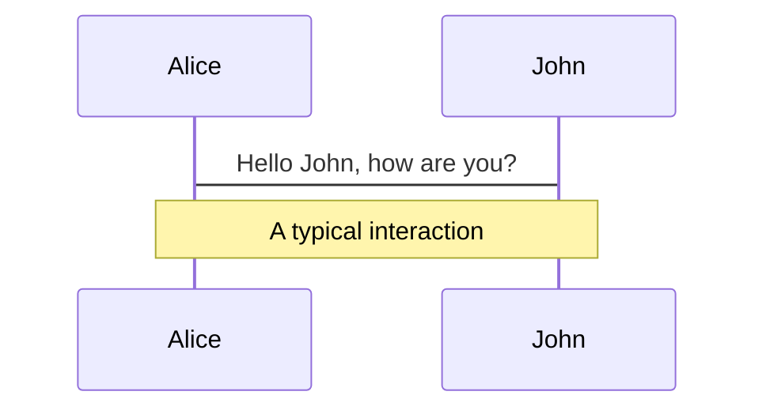
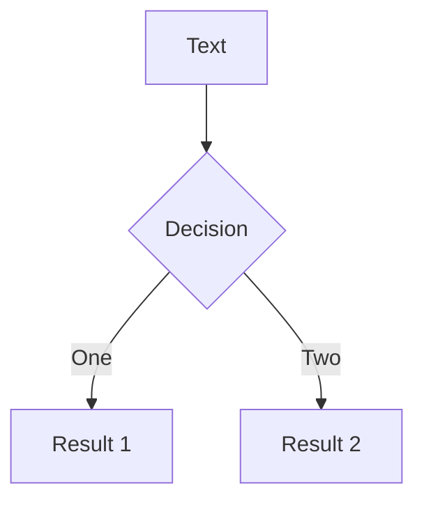
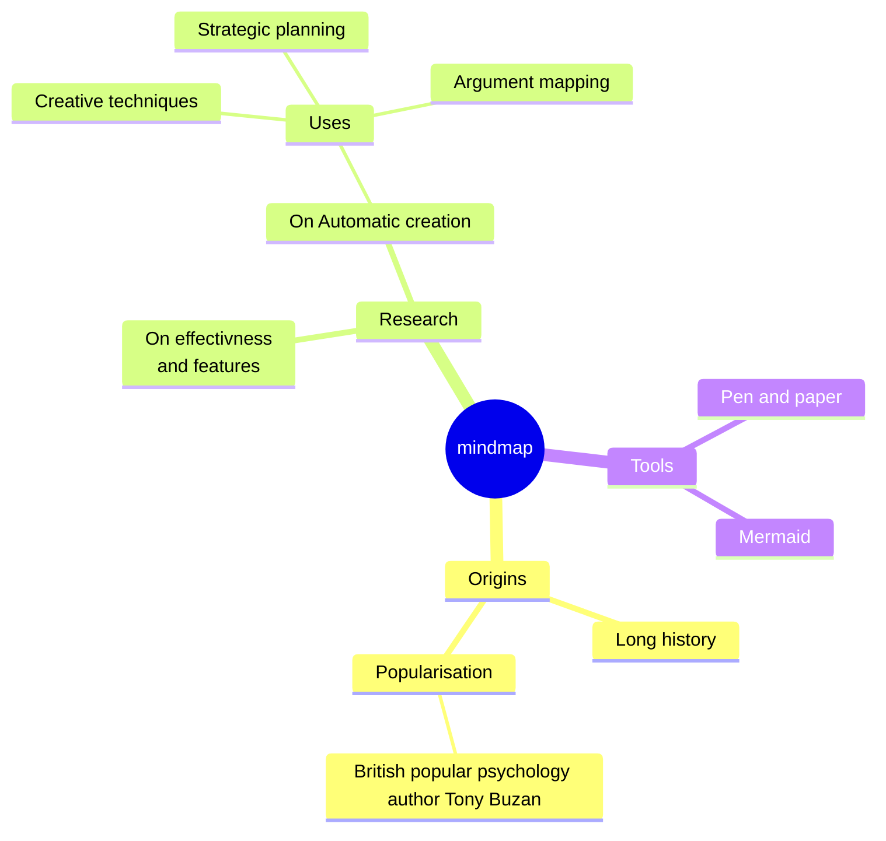
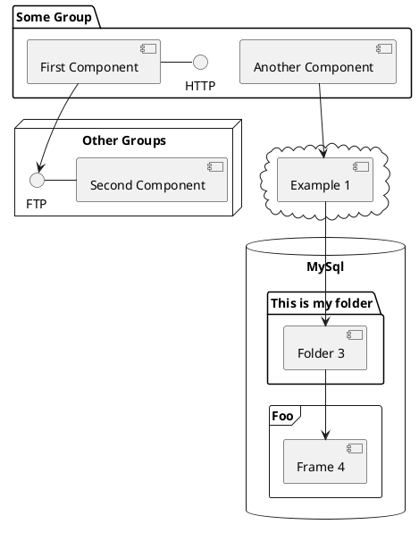

# Alessandro Candido

TH retreat 2023

<div class="pt-12">
  <span @click="$slidev.nav.next" class="px-2 py-1 rounded cursor-pointer" hover="bg-white bg-opacity-10">
    <carbon:arrow-right class="inline"/>
  </span>
</div>

<div class="abs-br m-6 flex gap-2">
  <a href="mailto:a.candido@cern.ch" class="text-xl slidev-icon-btn opacity-50 !border-none !hover:text-white">
    <carbon:email />
  </a>
  <a href="https://github.com/slidevjs/slidev" target="_blank" alt="GitHub" title="Open in GitHub"
    class="text-xl slidev-icon-btn opacity-50 !border-none !hover:text-white">
    <carbon-logo-github />
  </a>
</div>

<!--
The last comment block of each slide will be treated as slide notes. It will be visible and editable in Presenter Mode along with the slide. [Read more in the docs](https://sli.dev/guide/syntax.html#notes)
-->

---
transition: fade-out
layout: default
---

<div class="absolute top-0 left-0 w-full h-full" flex="~" justify="center">
  
</div>

---
transition: slide-up
level: 2
---

# NNPDF


|  |  |
| --- | --- |
| <kbd>DIS</kbd> | next animation or slide |
| <kbd>Evolution</kbd> | previous animation or slide |
| <kbd>Grids</kbd> / <kbd>FK tables</kbd> | previous slide |
| <kbd>Methodology</kbd> | next slide |


---
layout: image-right
image: '/assets/cryo.jpg'
---

# Quantum

<div class="absolute top-12 left-25 w-150 h-full" flex="~" justify="center">
  
</div>

---
layout: image-right
image: '/assets/qrc-lab.svg'
---

# Quantum
<br>

- sotware framework and user interface
- applications
- hardware execution & algorithms acceleration


<div absolute="~" bottom="10">
  <a href="https://files-prod.tii.ae/360/TII-QRC-Computing-Lab.html" italic="~" c="gray" font="size-3">
    TII Quantum computing lab
  </a>
</div>

---

# LaTeX

```ts {all|2|1-6|9|all}
interface User {
  id: number
  firstName: string
  lastName: string
  role: string
}

function updateUser(id: number, update: User) {
  const user = getUser(id)
  const newUser = { ...user, ...update }
  saveUser(id, newUser)
}
```

<!-- <arrow v-click="[3, 4]" x1="400" y1="420" x2="230" y2="330" color="#564" width="3" arrowSize="1" /> -->

<!--
[^1]: [Learn More](https://sli.dev/guide/syntax.html#line-highlighting)

<style>
.footnotes-sep {
  @apply mt-20 opacity-10;
}
.footnotes {
  @apply text-sm opacity-75;
}
.footnote-backref {
  display: none;
}
</style>
-->

---

# LaTeX

LaTeX is supported out-of-box powered by [KaTeX](https://katex.org/).

<br>

Inline $\sqrt{3x-1}+(1+x)^2$

Block
$$ {1|3|all}
\begin{array}{c}

\nabla \times \vec{\mathbf{B}} -\, \frac1c\, \frac{\partial\vec{\mathbf{E}}}{\partial t} &
= \frac{4\pi}{c}\vec{\mathbf{j}}    \nabla \cdot \vec{\mathbf{E}} & = 4 \pi \rho \\

\nabla \times \vec{\mathbf{E}}\, +\, \frac1c\, \frac{\partial\vec{\mathbf{B}}}{\partial t} & = \vec{\mathbf{0}} \\

\nabla \cdot \vec{\mathbf{B}} & = 0

\end{array}
$$

<br>

[Learn more](https://sli.dev/guide/syntax#latex)

---

# Diagrams

You can create diagrams / graphs from textual descriptions, directly in your Markdown.

<div class="grid grid-cols-4 gap-5 pt-4 -mb-6">









</div>

[Learn More](https://sli.dev/guide/syntax.html#diagrams)

---
layout: center
class: text-center
---

# Get in touch!

[Documentations](https://sli.dev) · [GitHub](https://github.com/slidevjs/slidev) · [Showcases](https://sli.dev/showcases.html)
