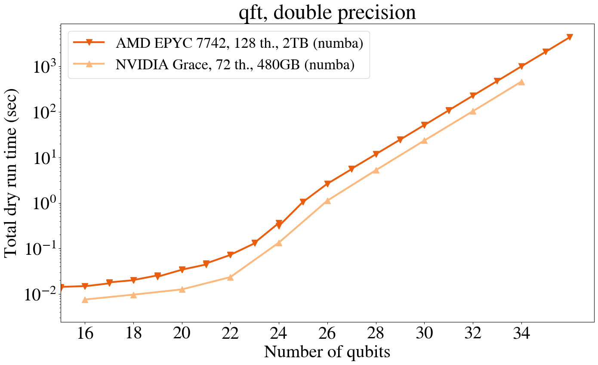
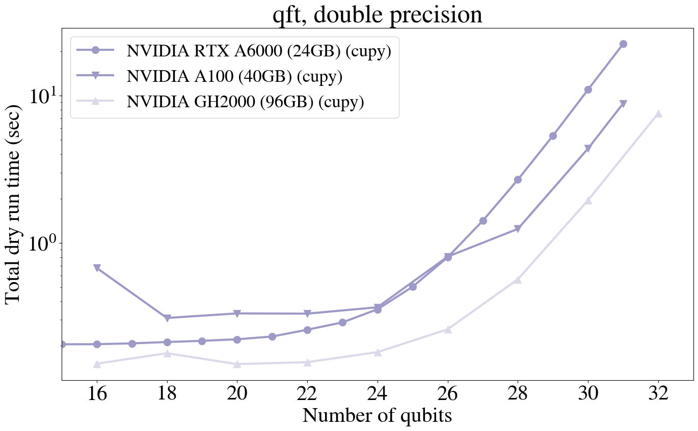
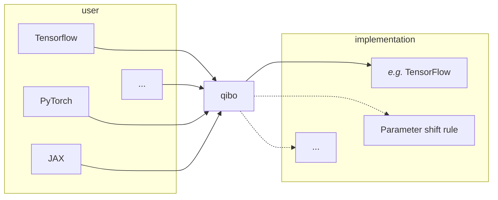
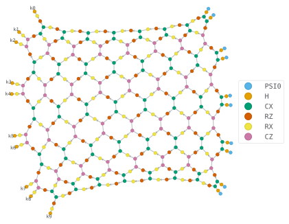
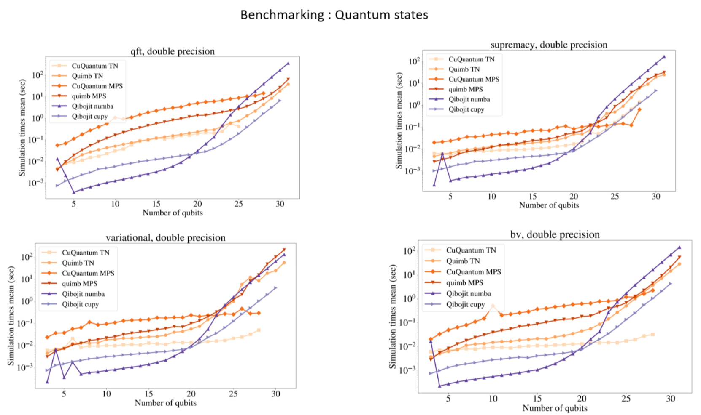
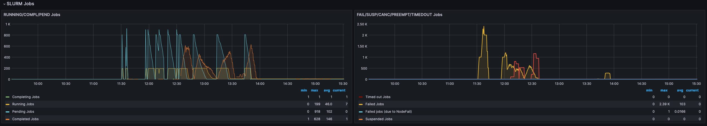

<h1 c="white">Simulation and Control</h1>

Quantum middleware

---

# Qibo

Execution

---

# State vector

Preserve whole information.

### Challenges

- linear algebra
    - *i.e. array library*
- performances
- memory management

### Approach

Adopt **widespread** and **optimized frameworks**, to benefit from their expertise
(*software reuse*).

**Chisel the last layer** on top of each framework, to mold it on our use case.

---

# Backends mechanism

Plug the framework.

 

Structure the integration of the various libraries.

Common operations are implemented once and reused (when possible).

---
transition: slide-up
---

# Results

  

    
    
  

  

    
    
  

---

  

    
    
  

  

    
    
  

<h3 text-right>

[*on advanced hardware*](https://gist.github.com/migueldiascosta/0a0dbe061982bc4cc2bc7171785a4b86)

</h3>

---

# Automatic differentiation

for quantum machine learning (QML)

  Autodiff simulation is fundamental to support QML investigation.

  A dedicated differentiable backend in simulation can considerably help algorithms
  development.

  Moving towards a single interface, encompassing both simulation and quantum hardware
  implementations.

*Framework portability: implement in one, export derivatives.*

---

# Clifford

pro:

- scalability
- error correction

---

# Tensor network

Optimized for observables.

Contractions:

[Inkscape plot]

---

# QiboTN

---
layout: image-left
image: assets/qrc-lab.svg
---

# Qibolab

Quantum control

---

# Interface

- platform
- pulses

---

# Drivers

---

# Qibosoq

---

# Towards multitech

- Input ->
  - circuits
  - pulses could be generic enough
- -> QPU
  - wrapped by drivers

---

# [Platform dashboard](http://login.qrccluster.com:10000/)

  
  

---

# Qibocal

An owed mention

  

---
layout: none
---

# [Qibocal reports](http://login.qrccluster.com:9000)

<iframe src="http://login.qrccluster.com:9000/" h="200%" w="200%" scale="50" translate="x--120 y--70"/>

---
layout: center
---

# Thanks
