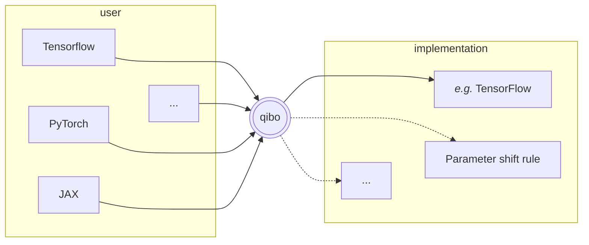
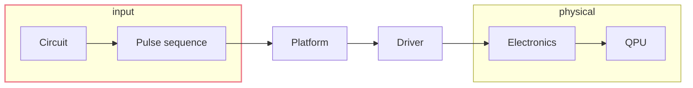
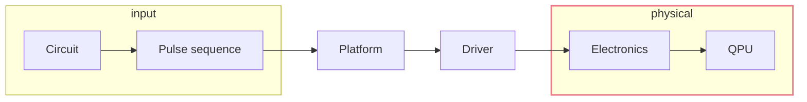
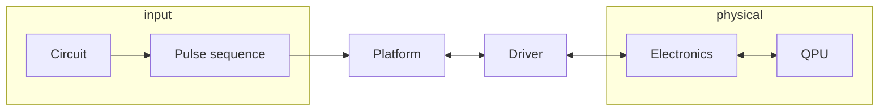

<h1 c="white">Simulation and Control</h1>

<p c="white">Quantum middleware</p>

<div absolute bottom--52 left--5 w-full m-x-5 flex="~ justify-between">
<p c-white italic>Alessandro Candido</p>

<div m-1 flex="~ row" p-2 gap-sm bg-gray-200 rounded>


</div>
</div>


---

# Qibo <cite-arxiv aref="2009.01845" text-sm/>

Execution


---

# State vector

Preserve whole information.

<div grid="~ cols-2" h="full" gap="lg" p="sm t-10 b-20" class="children:(flex-(~ col) p-sm)">
<div bg="dark:red-950 red-200">

<div flex="~ row justify-center" m="t-5 b-20">

### Challenges

</div>

- linear algebra
    - *i.e. array library*
- performances
- memory management

</div>
<div bg="dark:blue-950 blue-200">

<div flex="~ row justify-center" m="t-5 b-20">

### Approach

</div>

Adopt **widespread** and **optimized frameworks**, to benefit from their expertise
(*software reuse*).

**Chisel the last layer** on top of each framework, to mold it on our use case.

</div>
</div>

---

# Backends mechanism

Plug the framework.

<br m="2">

Structure the integration of the various libraries.


Common operations are implemented once and reused (when possible).

---
transition: slide-up
---

# Results <cite-arxiv aref="2203.08826 " text-sm/>

<div h="full" grid="~ cols-2" gap="sm" class="children:(flex-(~ col) gap-sm children:(rounded-md p-sm bg-white))">
  <div>
    
    
  </div>
  <div>
    
    
  </div>
</div>

---

<div h="full" m="t--35 b-30" grid="~ cols-2" gap="sm" class="children:(flex-(~ col justify-end) gap-sm children:(rounded-md p-sm bg-white))">
  <div>
    
    
  </div>
  <div>
    
    
  </div>
</div>

<h3 text-right>

[*on advanced hardware*](https://gist.github.com/migueldiascosta/0a0dbe061982bc4cc2bc7171785a4b86)

</h3>

---

# Automatic differentiation

for quantum machine learning (QML)


<div grid="~ cols-3" m-t-15>
<div>
  Autodiff simulation is fundamental to support QML investigation.

  A dedicated differentiable backend in simulation can considerably help algorithms
  development.

  Moving towards a single interface, encompassing both simulation and quantum hardware
  implementations.
</div>

<div col-span-2>



*Framework portability: implement in one, export derivatives.*

</div>
</div>

---

# Clifford


Specialized execution.


<div h="85%" grid="~ cols-2" gap-sm>
<div>

<br m--4>

$$
    \ket{\psi} = U \ket{\psi}
$$

<div p="x-5 y-1" bg="gray-200 dark:gray-800">

**Theorem 1** *Given an n-qubit state $\ket{\psi}$, the following are
equivalent:*

<div m-l-3 text-sm>

(i) *$\ket{\psi}$ can be obtained from $\ket{0}\otimes n$ by CNOT,
Hadamard, and phase gates only.*<br>
(ii) *$\ket{\psi}$ can be obtained from $\ket{0}\otimes n$ by CNOT,
Hadamard, phase, and measurement gates only.*<br>
(iii) *$\ket{\psi}$ is stabilized by exactly 2n Pauli operators.*<br>
(iv) <span underline>***$\ket{\psi}$ is uniquely determined by $S (\ket{\psi}) = Stab
(\ket{\psi})\cap P_{n}$ or the group of Pauli operators that stabilize
$\ket{\psi}$***</span>

</div>

</div>

</div>
<div flex="~ col justify-center" text-sm>

$$
\left(
\begin{array}{ccc|ccc|c}
x_{11} & \dots & x_{1n} & z_{11} & \dots & z_{1n} & r_1 \\
\vdots & \ddots & \vdots & \vdots & \ddots & \vdots & \vdots \\
x_{n1} & \dots & x_{nn} & z_{n1} & \dots & z_{nn} & r_n \\
\hline
x_{(n+1)1} & \dots & x_{(n+1)n} & z_{(n+1)1} & \dots & z_{(n+1)n} & r_{n+1} \\
\vdots & \ddots & \vdots & \vdots & \ddots & \vdots & \vdots \\
x_{(2n)1} & \dots & x_{(2n)n} & z_{(2n)1} & \dots & z_{(2n)n} & r_{2n} \\
\end{array}
\right)
$$

Instead of operating on the whole state vector, the state is represented by a much more
compressed *tableau*.

It still requires vectorized operations on the boolean entries, that can be optimized in
a similar fashion to the general state vector approach.

</div>
</div>

---
clicks: 1
---

# Clifford

Benchmarks

<div m-t--10 h-full w-full flex="~ justify-center items-center">
  <div bg-white rounded-xl p-2>
    
  </div>
  <div absolute w-130 h-90 bg="white op-50" rounded-xl p-2 v-click="1"/>
</div>
<p absolute top="55%" left="25%" text-15 font-600 rotate--30 c-red-700 v-click="1">Work in progress</p>

---
clicks: 3
---

# Tensor network

Optimized for observables.

<div grid="~ cols-5" gap="lg">

<div col-span-3>

</div>

<div col-span-2>

### Contractions

<div m-t-15 w-full flex="~ row justify-center">
<div w-50 h-50 bg-white rounded-3xl flex="~ justify-center items-center" p="l-5 t-2" class="children:(absolute w-50 h-50)">


</div>
</div>

</div>
</div>

---
clicks: 1
---

# Tensor network 

beyond `opt_einsum`

<div grid="~ cols-2" gap="lg">
<div>

### Approximation

<div text-sm>

Based on singular value decomposition (SVD).

<div w-full flex="~ row justify-center">

</div>

A very frequent matrix product state (MPS).

But also other ansatzes are used.

</div>

</div>
<div>

### Workload distribution

<div m-y-3 w-full flex="~ row justify-center">
<div w-90 h-40 bg-white rounded-3xl flex="~ justify-center items-center" class="children:(absolute w-70 h-50)">


</div>
</div>

<!-- The graph picture, on top of finding the best contractions, makes another feature -->
<!-- manifest: there are blocks of operations more self-connected than others. -->
<!---->
<!-- They could be dispatched for separate computation on distributed resources. -->

```py
for q in range(nq):
    c.apply_gate('H', q)

for q in range(0, nq, 2):
    c.apply_gate('CNOT', q, q + 1)

c.apply_gate('CNOT', 4, 7)
c.apply_gate('CNOT', 4, 1)
c.apply_gate('CNOT', 4, 0)
```

</div>
</div>

---
clicks: 1
---

# QiboTN

<div w="full" flex="~ row justify-center">

<div absolute w-170 h-103 bg="white op-50" rounded-xl p-2 v-click="1"/>
</div>
<p absolute top="55%" left="25%" text-15 font-600 rotate--30 c-red-700 v-click="1">Work in progress</p>

---
layout: image-left
image: /assets/qrc-lab.webp
---

<div fixed bottom-12 left-15 text-xs italic c-gray-800>
<a href="https://files-prod.tii.ae/360/TII-QRC-Computing-Lab.html">TII lab</a>
</div>

<div flex="~ col justify-center" h-full p-10>

# Qibolab <cite-arxiv aref="2308.06313" text-sm/>

Quantum control

</div>

---
transition: abrupt
---

# Qibolab - Interface

<div w="full children:90%" flex="~ justify-center row" >



</div>

<div grid="~ cols-2 rows-3" h="65%" gap-sm p="sm t-0">
<div row-span-2>

The **<span underline>input</span>** for a computation could be very standard, at the
level of a **circuit**.
That kind of interface is already defined by <span underline>Qibo</span> itself.

However, at a lower level, **pulses** are still a standard-enough way to interact with
hardware, and these are defined by <span underline>Qibolab</span>.

</div>
<div col-start-1>
    Pulse sequence plot (from notebook?)
</div>
<div row-span-3 row-start-1 col-start-2>

```python
def create():
    instrument = DummyInstrument("myinstr", "0.0.0.0:0")

    channels = ChannelMap()
    channels |= Channel(
        "readout", 
        port=instrument.ports("o1")
    )
    ...

    return Platform(
        "myplatform", 
        qubits={qubit.name: qubit}, 
        instruments={instrument.name: instrument},
        ...
    )
```

</div>
</div>

---
transition: abrupt
---

# Qibolab - Drivers

<div w="full children:90%" flex="~ justify-center row" >



</div>

<div grid="~ cols-5" gap-sm p="sm" m-t-5>
<div flex="~ col justify-center items-center" m-t--10>
<div p="sm x-2xl" rounded bg="slate-200 dark:slate-800">

- [Qblox](https://www.qblox.com/)
- [Zurich](https://www.zhinst.com/)
- [QM](https://www.quantum-machines.co/)
- [QICK](https://github.com/openquantumhardware/qick)

</div>
</div>
<div col-span-4>

```sh
      move      1,R0        # Start at marker output channel 0 (move 1 into R0)
      nop                   # Wait a cycle for R0 to be available.

loop: set_mrk   R0          # Set marker output channels to R0
      upd_param 1000        # Update marker output channels and wait 1μs.
      asl       R0,1,R0     # Move to next marker output channel (left-shift R0).
      nop                   # Wait a cycle for R0 to be available.
      jlt       R0,16,@loop # Loop until all 4 marker output channels have been set once.

      set_mrk   0           # Reset marker output channels.
      upd_param 4           # Update marker output channels.
      stop                  # Stop sequencer.
```

<div m-t--10 z-2 relative>
<p text-right italic m-r-20>

by
[Qblox](https://qblox-qblox-instruments.readthedocs-hosted.com/en/master/cluster/q1_sequence_processor.html#example)

</p>
</div>

</div>
</div>

---

# Qibosoq - Server on QICK <cite-arxiv aref="2310.05851" text-sm/>


<div w="full children:90%" flex="~ justify-center row" >
<div flex="~ col">



<div m="t--1" text-xs italic>
Qibolab handles the whole connection, and takes care of fetching the single or multiple results.
</div>
</div>
</div>

<div m-lg grid="~ cols-2" gap-sm>
<div flex="~ col justify-center">

For the single open source platform currently in Qibolab, there has been a dedicate
effort to define a suitable server, to optimize the communication with the board.

<p text-right>
&xrarr; Qibosoq
</p>

</div>
<div flex="~ col items-center">
  
</div>
</div>

<p absolute bottom--3 left-10 text-sm italic>

in collaboration with **INFN-UNIMIB-BIQUTE**

</p>

---

# [Platform dashboard](http://login.qrccluster.com:10000/)

<div h-full p-lg flex="~ col justify-center" gap="lg" class="children:(w-full p-lg rounded-lg bg-#111217)">
  
  
</div>

---

# Qibocal

An owed mention

<div flex="~ justify-center" h="full">
  
</div>


---
layout: none
---

<div z--2 absolute="~" h="full" w="full" flex="~ justify-center items-center">

# [Qibocal reports](http://login.qrccluster.com:9000)

</div>

<iframe src="http://login.qrccluster.com:9000/" h="200%" w="200%" scale="50" translate="x--120 y--70"/>

---
layout: center
---

# Thanks

---

# Hybrid compilation


<div h="80%" w-full m-b--10 flex="~ justify-center items-center">
  <div bg-white rounded-lg p-2>
    <a href="https://docs.pennylane.ai/projects/catalyst/">
      
    </a>
  </div>
</div>

Target both simulation and hardware. Optimize classical and quantum instructions.
Optimal for QML-like hybrid applications.

---

# Continuous variables

Simulation

<div h="80%" grid="~ cols-2">
  <div>

[Strawberry Fields](https://strawberryfields.ai/)

  </div>
  <div flex="~ justify-center items-center">
    <div w="80%" p-2 bg-white rounded-lg>
      
    </div>
  </div>
</div>
