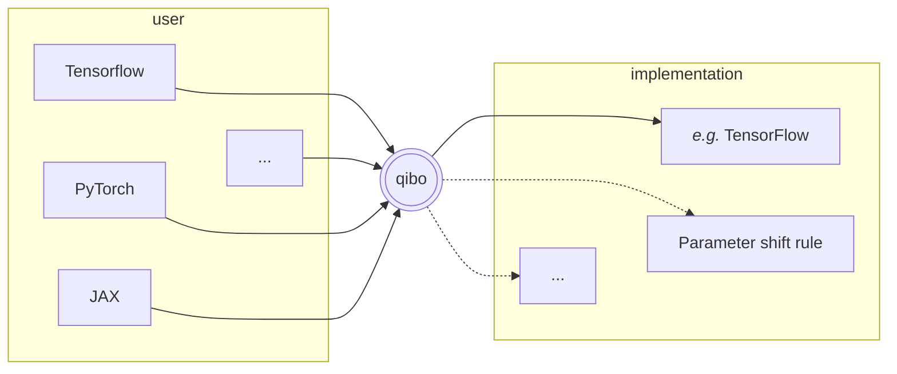
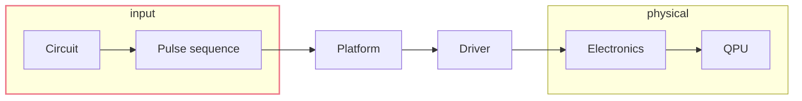
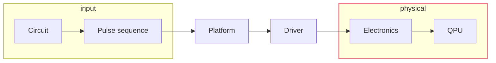
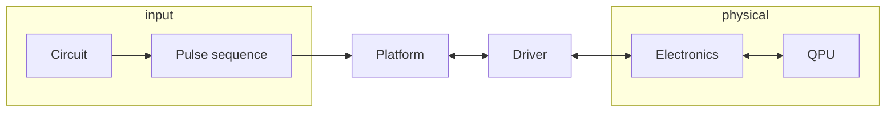

::block-component{flex="~ justify-end" w="full"}

<div m-t--30 m-r-10>
  <div text-size-5xl bg-purple w-25 transform-skew-x-30>
    <p transform-skew-x--30>Qibo</p>
  </div>

  <div bg-purple transform-skew-x-30 w-50>
    <p transform-skew-x--40>A quantum computing framework</p>
  </div>
</div>

::

---
layout: fact
---

*A bit of context...*

---

# R&D and adoption of new technologies in HEP

HEP is moving towards new technologies, in particular hardware accelerators

<div flex="~ justify-center items-center" w-full>
  <white-image src="chips.png" w="70%"/>
</div>

<div m-y-5 m-l-10>
  Moving from <span v-mark.underline.red>general purpose devices</span>
  &rArr;
  <span v-mark.circle.blue>application specific</span>
</div>

<div v-click>
  Examples of initiatives and institutions involved:

  <div flex="~ justify-center items-center gap-sm" w-full>
    <white-image src="qti.png" h-25 p-sm/>
    <white-image src="infn.png" h-25 p-sm/>
    <white-image src="biqute.png" h-25 p-sm/>
  </div>
</div>


---

::block-component{m="t-20"}
E.g.
::

<div flex="~ justify-center items-center" w-full m-t-3 m-b-8>
  <white-image src="event.png" p-sm w="70%"/>
</div>

Monte Carlo simulation and data analysis are intensive and requires lots of computing
power.

----

# Quantum computing for HEP experiments

QC4HEP WG <cite-arxiv aref="2307.03236" inline-block text-sm/>


<div grid="~ cols-2" m-y-8 class="children:(flex-(~ justify-center) gap-sm children:(rounded-xl w-80%))">
  <div>
    
  </div>
  <div>
    
  </div>
</div>

Many experimental and theoretical HEP applications are deemed to benefit from quantum
computation.

---
layout: fact
---

*Recap*


---

<div flex="~ justify-center items-center" w-full>
  <white-image src="quantum-computing.png" w="80%" p-sm/>
</div>

<div grid="~ cols-2" m-10>
  <div>
    <div text-size-3xl bg-red-700 w-35 transform-skew-x-30>
      <p skew-x--30>Simulation</p>
    </div>
<p>

- required to develop algorithms
- complete introspection
- require noise modeling

</p>
  </div>
  <div>
    <div text-size-3xl bg-orange-500 w-32 transform-skew-x-30>
      <p skew-x--30 translate-x--1>Hardware</p>
    </div>
<p>

- limited (in many senses)
- requires calibration
- final validation

</p>
  </div>
</div>

---

# Discrete gates primer

***Goal:*** Construct a generic $U(2^n)$ operation based on building blocks

The Hilbert space on which the unitaries act is a strutured as a $\bigotimes$ tensor
product of $n$ qubits

$$
\ket{0} = \begin{pmatrix} 1 \\ 0 \end{pmatrix}
\qquad \qquad \qquad
\ket{1} = \begin{pmatrix} 0 \\ 1 \end{pmatrix}
$$


<div grid="~ cols-7" m-10>
  <div col-span-4 flex="~ col justify-center">
the generic qubit state is:

$$
\ket{\psi} = \alpha \ket{0} + \beta \ket{1}
\qquad
\mathrm{with}~~ |\alpha|^2 + |\beta|^2 = 1
$$

and it can be visualized as a point on the Bloch sphere

$$
\alpha = \cos{\theta/2}
\qquad
\beta = e^{-i\phi}\sin{\theta/2}
$$
  </div>
  <div col-span-3 flex="~ justify-center">
      <white-image src="bloch-sphere.svg" w="65%" p-sm/>
  </div>
</div>

---

# Example gates: Pauli

<div grid="~ cols-2 gap-sm" w-full m-t-10 class="
  children:first:children:children:(m-0! p-2)
  children:children:children:c-black
  first:children:children:(b-(dashed 4) m-b-5)
  not-first:children:children:(w-full p-3 rounded)
  children:(flex-(~ col items-center) w-full)">
  <div>
<div b="emerald600" class="first:children:bg-emerald200">

$X$ gate

</div>
<div bg-emerald100>

The $X$ gate acts like the classical $NOT$ gate, it is represented by the $\sigma_x$
matrix,

$$
\sigma_x = \begin{pmatrix}0 & 1 \\ 1 & 0\end{pmatrix}
$$

therefore

$$
\ket{0} \longrightarrow \ket{1} \\
\ket{1} \longrightarrow \ket{0}
$$

</div>
  </div>
  <div>
<div b="fuchsia" w-fit class="first:children:bg-fuchsia200">

$Z$ gate

</div>
<div bg-fuchsia100>

The $Z$ gate flips the sign of $\ket{1}$, it is represented by the $\sigma_z$
matrix,

$$
\sigma_z = \begin{pmatrix}1 & 0 \\ 0 & -1\end{pmatrix}
$$

therefore

$$
\ket{0} \longrightarrow \ket{0} \\
\ket{1} \longrightarrow -\ket{1}
$$

</div>
  </div>
</div>

---
layout: image-right
image: /assets/gates.png
class: z-1
---

<div absolute z--1 top-0 left-0 w-full h-full
  backdrop="blur-1.5 hover:blur-0 brightness-80 hover:brightness-90"/>

<div w-full flex="~ col items-center" class="
  children:children:children:(c-teal-600 dark:c-teal-400)
  not-first:children:children:children:(italic text-sm)
  ">
  <div>
    <div>
      <ph-dice-one/> Single-qubit gates
<p>

These are operations on the Bloch sphere

</p>
    </div>
    <div>
      <ph-dice-two/> Two-qubit gates
<p>

The building-block interactions

</p>
    </div>
    <div>
      <ph-dice-six/> Multi-qubit gates
<p>

Higher-level instructions for algorithms

</p>
    </div>
  </div>
</div>

<p p-t-5 p-b-3>
<aim/>
  Define a <span v-mark.highlight.green>universal</span> gate set
</p>

<p text-sm>

- <span c-green-700 dark:c-green-300 font-bold>universality</span> means it can generate all unitarities
- possibly <span c-green-600 font-bold>redundant</span>, since it may be efficient to execute
- <span c-green-600 font-bold>multiple</span> implementations, related to diverse hardware

Gates could be variously parametrized, so there exists universal sets made beyond

</p>

---

# Circuit

Unitary - but measurements.

<div m-10/>

Circuit are a way to compose gates to build unitaries, ***sequentially***

<div w-full flex="~ justify-center" m-5>
  <white-image src="circuit-composition.png" p-sm/>
</div>

or in ***parallel***

<div w-full flex="~ justify-center" m-5>
  <white-image src="circuit-parallel.png" p-sm/>
</div>

---

<div text-size-5xl bg-rose-200 dark:bg-rose-800 transform-skew-x-30 w-50>
  <h1 skew-x--30 w-100>Parametrized gate</h1>
</div>

<div m-x-30 m-y-10 rounded shadow-xl shadow-gray-300 dark:shadow-gray-700>
  <h4 
    rounded-t p-1 p-x-5 z-1 relative
    c-black italic font-bold bg-gradient="to-rb from-rose-300 to-rose-400">
  Rotations gates (Bloch sphere)
  </h4>
  <div 
    flex="~ justify-between"
    b="1 rose-400" m-t--1 p-0 rounded-b>
<div p-3 flex="~ col justify-center" text-sm>

$$
R_y(\theta) \equiv e^{-i \theta \frac{\sigma_y}{2}}
= \begin{pmatrix}
\cos(\theta/2) & -\sin(\theta/2) \\
\sin(\theta/2) & \cos(\theta/2) 
\end{pmatrix}
$$

Note that $R_y(\pi) \equiv Y$.

Every unitary transformation as decomposed in rotations (*Euler's angles*)
</div>
    
  </div>
</div>

Other parameters are possible: $GPI$ and $GPI2$ parametrize the position of the axis,
multi-qubit gates can paramterize complex interactions, ...

<div m-7/>

Having parameters, it opens the door to
<span v-mark.underline.red>optimization <ph-rocket-launch c-rose/></span>
&rarr; i.e. quantum machine learning (QML)

---

<div text-size-5xl bg-purple-200 dark:bg-purple-800 transform-skew-x--30 w-40>
  <h1 skew-x-30 w-100>Two-qubit gate</h1>
</div>
<h1/>

The atoms of interaction


<div m-x-30 m-b-10 rounded shadow-xl shadow-gray-300 dark:shadow-gray-700>
  <h4 
    rounded-t p-1 p-x-5 z-1 relative
    c-black italic font-bold bg-gradient="to-rb from-purple-300 to-purple-400">
  Controlled gates (conditionals)
  </h4>
  <div 
    flex="~ justify-between"
    b="1 purple-400" m-t--1 p-0 rounded-b>
  <div p-t-5 p-l-5 text-sm flex="~ justify-between">
<div w="60%">
The controlled-$NOT$ ($CNOT$) gate is a conditional gate defined as

$$
CNOT \equiv \begin{pmatrix}
1 & 0 \\
0 & \sigma_x
\end{pmatrix}
$$

We define a control qubit which, if at $\ket{1}$, applies $X$ to a target qubit.
</div>
<div p-5>
    <div m-l-3 m-t--5>
      <span c="#98c">control</span>
      <br/>
      <span c="#c49">target</span>
    </div>

$$
\ket{\textcolor{#98c}{0}\textcolor{#c49}{0}} \to \ket{\textcolor{#98c}{0}\textcolor{#c49}{0}}
\qquad 
\ket{\textcolor{#98c}{0}\textcolor{#c49}{1}} \to \ket{\textcolor{#98c}{0}\textcolor{#c49}{1}}
$$
$$
\ket{\textcolor{#98c}{1}\textcolor{#c49}{0}} \to \ket{\textcolor{#98c}{1}\textcolor{#c49}{1}}
\qquad 
\ket{\textcolor{#98c}{1}\textcolor{#c49}{1}} \to \ket{\textcolor{#98c}{1}\textcolor{#c49}{0}}
$$

</div>
    </div>
  </div>
</div>

<div flex="~ justify-around" h-30 m-10>
<div flex="~ col justify-center items-center" h-full w-full>

Multi-qubit gates allow entangling states

</div>
<div>
  <white-image src="bell-state.png" w-80 p-2 m-t--5 z--1 class="dark:z-1" relative/>
</div>
</div>

---

<div text-size-5xl bg-indigo-200 dark:bg-indigo-800 transform-skew-x-30 w-50>
  <h1 skew-x--30 w-100>Measurement</h1>
</div>
<h1/>

The non-unitary gate *that you have*

<div m-l-10>
Measurements are special gates, in two ways:

<div m-l-10 m-y-3>

1. it is the only operation that allows to extract information
2. it is the only non-unitary gate

</div>
</div>
<div m-x-30 m-y-5 rounded shadow-xl shadow-gray-300 dark:shadow-gray-700>
  <h4 
    rounded-t p-1 p-x-5 z-1 relative
    c-black italic font-bold bg-gradient="to-rb from-indigo-300 to-indigo-400">
  Shots
  </h4>
  <div 
    flex="~ justify-between"
    b="1 indigo-400" m-t--1 p-0 rounded-b>
  <div p-l-5 text-sm flex="~ justify-between">
<div w="60%">

(Module of) amplitudes of the final states are derived by repeating the experiment many
times identically, performing many *shots*.

<div flex="~ justify-center" w-full m-t--2>
  <white-image src="measurement.png" w="45%" p-1/>
</div>

</div>
<div>
  <white-image src="frequencies.png" p-0 h-50 rounded="0! br!"/>
</div>
    </div>
  </div>
</div>

---

<div grid="~ cols-2 gap-xl" w-full h-full>
<div>

# Noise and channels
Non-unitary operations model

<br/>

Instead of acting over a <span v-mark.cross.blue>state vector</span>, the state will be
tracked by a <span v-mark.highlight.red>density matrix</span>

$$
\ket{\psi} \quad\longrightarrow\quad \rho \quad\left(~\sim \ket{\psi}\bra{\psi}~\right)
$$

This makes possible to track phenomena like <span
v-mark.underline.red="2">decoherence</span>, which has not a unitary action on the state.

<br>

Another option is to exploit measurement non-unitarity, and represent the noise through
<span v-mark="{'type': 'underline', 'color': '#f87171', 'multiline': 'true', 'at': 2}">*repeated execution*</span>.

</div>
<div flex="~ col justify-center" h-full m-l-5>

- Kraus

$$
\Phi(\rho) = \sum_i B_i \rho B_i^*
$$

- Stinespring

$$
U_{0} = \sum_{\alpha} K_{\alpha} \otimes \ket{\alpha}\bra{v_{0}}
$$

- Choi

$$
\Lambda = | U \rangle\rangle \langle\langle U |
$$

- Liouville, Quantum networks, ...

</div>
</div>

---
layout: fact
---

*Applications*

---
clicks: 2
---

<div w-full h-full m-t--2 flex="~ justify-center items-center">
  <div>
    <div text-size-5xl bg-indigo-200 dark:bg-indigo-800 w-112 top--46 left--30 transform-skew-x--30 z-1 relative>
      <h1 skew-x-30 translate-x--3>Quantum machine learning</h1>
    </div>
    <div flex="~ justify-center items-center"  class="children:(absolute)">
      <white-image src="opt-1.png" w="65%" p-sm v-click="[0,1]"/>
      <white-image src="opt-2.png" w="65%" p-sm v-click="[1,2]"/>
      <white-image src="opt-3.png" w="65%" p-sm v-click="[2,3]"/>
    </div>
    <div text-right c-gray italic top-55 left-30 relative>
      credits M. Robbiati
    </div>
  </div>
</div>

---

<h1>
QML -
<div inline-block text-size-5xl bg-fuchsia-300 dark:bg-fuchsia-800 w-40 transform-skew-x-40 m-l-4>
  <div inline-block skew-x--40 translate-x--3>remarks</div>
</div>
</h1>

A classical function being clasically optimized.

<div flex="~ justify-around gap-xl" m-x-5>
<div flex="~ col justify-around" m-l-10>

$$
\bar{y}_{est}(\bar{\theta}) = \bra{0} U(\bar{\theta}) \ket{0} \quad: \quad \mathbb{R}^n \to \mathbb{R}^m
$$

<div flex="~ justify-around">
<div>
If a first-order optimization <ph-rocket-launch/> method used, gradient calculation may be 
"quantum-aware" (PSR).
</div>
<div flex="~ col justify-around" text-2xl>
&rarr;
</div>
</div>

</div>
<div m-l-10>
  <white-image src="psr.png" p-3 h-55 aspect-2/>
</div>
</div>

<div grid="~ cols-2" class="
  first:children:children:(flex-(~ row justify-center) text-10)"
  m-t-5
>
  <div>
    <div>
      <ph-clock/>
    </div>
<div>

The advantage is mainly in the <span v-mark.highlight.blue="1">inference time</span>, and
possibly ansatz expressivity.

</div>
  </div>

  <div>
    <div>
      <ph-pulse/>
    </div>
<div>

Quantum computation is naturally based on 
<span v-mark.underline.blue="1">continuous variables</span>.
But in practice they are generated through digital control electronics with
<span v-mark.highlight.red="1">noisy calibrated pulses</span>

</div>
  </div>
</div>

---

# qPDF <cite-arxiv aref="2011.13934" inline-block text-sm/>

<p>
  <aim/> Parametrize 
  <span v-mark.underline.orange font-bold italic>Parton Distribution Functions (PDF)</span>
  with multi-qubit variational quantum circuits
</p>

<div flex="~ justify-around" w-full m-t--1>
  <div>

<p m-1>
  <ph-lightning c-yellow/>
  <span v-mark.highlight.yellow c-gray900>Algorithm’s summary</span>:
</p>
<div text-sm>

1. Define a quantum circuit: $\mathcal{U}(\theta, x)\ket{0}^{\otimes n} =
   \ket{\psi(\theta,x)}$
2. $\mathcal{U}_w(\alpha, x) = R_z(\alpha_3\log(x)+\alpha_4) R_z(\alpha_1\log(x)+\alpha_2)$
3. Using $z_i(\theta, x) = \bra{\psi(\theta, x)}Z_i\ket{\psi(\theta, x)}$

$$
\textrm{qPDF}_i(x, Q_0, \theta) = \frac{1-z_i(\theta, x)}{1+z_i(\theta, x)}
$$

</div>
  </div>
  <div w="40%" m-t--3>
    <white-image src="quantum-pdf-circuit.png" w="80%" m-5 p-sm/>
  </div>
</div>

<div flex="~ justify-center items-center" w-full m-t-2>
  <white-image src="quantum-pdf.svg" w="75%" p-3 rounded-sm/>
</div>

---

# Density estimation with adiabatic QML <cite-arxiv aref="2303.11346" inline-block text-sm/>

<p>
  <aim/> Determining
  <span v-mark.underline.orange font-bold italic>Probability Density Functions (PDF)</span>
</p>

<div grid="~ cols-5" m-t--2>
  <div col-span-3>

by fitting the corresponding Cumulative Density Function
(CDF) using an adiabatic QML ansatz.

<div m-y-14/>

<p>
  <ph-lightning c-yellow/>
  <span v-mark.highlight.yellow c-gray900>Algorithm’s summary</span>:
</p>

<div m-5 text-sm>

1. Optimize the parameters $\bar{\theta}$ using adiabatic evolution:
    $H_{ad}(\tau ; \bar{\theta}) = [1 − s(\tau ; \bar{\theta})] \hat{X} + s(\tau ; \bar{\theta}) \hat{Z}$
    in order to approximate some target CDF values
2. Derivate from $H_{ad}$ a circuit $\mathcal{C}(\tau ; \bar{\theta})$ whose action on
    the ground state of $\hat{X}$ returns $\ket{\psi(\tau)}$
3. The circuit at step 2 can be used to calculate the CDF
4. Compute the PDF by derivating $\mathcal{C}$ with respect to $\tau$ using the Parameter Shift Rule

</div>

  </div>
  <div col-span-2 m-t--5 p-x-8>

<white-image src="adiabatic.png" p-2 h-110/>

  </div>
</div>

---
layout: fact
---

*Quantum hardware*

---

# Quantum computation

Various models are proposed and explored

<br m-t-5/>

1. discrete gate-based
2. continuous variable (a.k.a. bosonic)
3. quantum annealing

<br m-t-5/>

The potential use cases partially overlap, and it is possible to emulate each other (at
least approximately).

<div text-right m-t-25>
They are particularly related to the hardware realizing them...
</div>

---

# Technologies

Many technologies simultaneously investigated <cite-arxiv aref="2304.14360"
inline-block text-sm/>

<div flex="~ justify-center items-center" w-full>
  <white-image src="techs.png" w="65%" p-2/>
</div>

<div m-t-5 m-l-10 class="children:(text-sm m-y-1!)">

Pros and cons for each, investigated by different groups, including diverse private
companies.

Some optimal for specific applications, others for further
usage, e.g. quantum memories <cite-arxiv aref="1511.04018"
inline-block text-sm/>.

</div>

---

# Superconducting

One of the platforms with most resonance

::block-component{grid="~ cols-2" w="full" gap="sm"}
  :::block-component{grid-col="start-1 end-2" bg="blue"}
    
  :::
  :::block-component{grid-col="start-2" bg="purple"}
    
  :::
::

<p>
<brand>IBM</brand> and <brand>Google</brand> are definitely two prominent players, but
superconducting hardware is being investigated by a plethora of labs.
</p>

Within the scope of this technology, many variations are also possible (flux-tunable
qubits, couplers, cross-resonance schemes), so it is a macro-category.

---

# Neutral atoms

<div flex="~ justify-center items-center" w-full m-y-5>
  
</div>

<p>
<brand>Atom computing</brand> have been the first to claim >1000 qubits <cite-arxiv aref="2401.16177" inline-block text-sm/>
</p>

---

# Control

Quantum hardware is first of all an exercise in precise control

<div grid="~ cols-2" m-y-8 class="children:(flex-(~ justify-center) gap-sm children:(rounded-xl w-80%))">
  <div>
    
  </div>
  <div>
    <div bg-white flex="~ col justify-center">
      
    </div>
  </div>
</div>

The quantum operation is supposed to be exact, not within a certain range.

---
layout: fact
---

*Qibo*

*- Your quantum workhorse -*

---
layout: full
---

# The ecosystem

<div flex="~ justify-center items-center" w-full h-full m-t--5>
  
</div>

---
layout: full
---

<div flex="~ justify-center items-center" w-full h-full m-t--5 m-b-5>
  <white-image src="contributors.png" p-lg/>
</div>

<div text-right italic>
  Contributors (March 2024)
</div>

---

# Qibo <cite-arxiv aref="2009.01845" text-sm/>

Execution


---

# Backends mechanism

Plug the framework.

<br m="2">

Structure the integration of the various libraries.


Common operations are implemented once and reused (when possible).

---

# Results <cite-arxiv aref="2203.08826 " text-sm/>

<div h="full" grid="~ cols-2" gap="sm" class="children:(flex-(~ col) gap-sm children:(rounded-md p-sm bg-white))">
  <div>


  </div>
  <div>


  </div>
</div>

<h3 absolute bottom-10 left-0 z--1 p-x-20 w-full text-right>

[*on advanced hardware*](https://gist.github.com/migueldiascosta/0a0dbe061982bc4cc2bc7171785a4b86)

</h3>

---

# Automatic differentiation

for quantum machine learning <em m-l-7>&rarr; Qiboml</em>


<div grid="~ cols-3" m-t-15>
<div>
  Autodiff simulation is fundamental to support QML investigation.

  A dedicated differentiable backend in simulation can considerably help algorithms
  development.

  Moving towards a single interface, encompassing both simulation and quantum hardware
  implementations.
</div>

<div col-span-2>



*Framework portability: implement in one, export derivatives.*

</div>
</div>

---

# Clifford


Specialized execution.


<div h="85%" grid="~ cols-2" gap-sm>
<div>

<br m--4>

$$
    \ket{\psi} = U \ket{\psi}
$$

<div p="x-5 y-1" bg="gray-200 dark:gray-800">

**Theorem 1** *Given an n-qubit state $\ket{\psi}$, the following are
equivalent:*

<div m-l-3 text-sm>

(i) *$\ket{\psi}$ can be obtained from $\ket{0}\otimes n$ by CNOT,
Hadamard, and phase gates only.*<br>
(ii) *$\ket{\psi}$ can be obtained from $\ket{0}\otimes n$ by CNOT,
Hadamard, phase, and measurement gates only.*<br>
(iii) *$\ket{\psi}$ is stabilized by exactly 2n Pauli operators.*<br>
(iv) <span underline>***$\ket{\psi}$ is uniquely determined by $S (\ket{\psi}) = Stab
(\ket{\psi})\cap P_{n}$ or the group of Pauli operators that stabilize
$\ket{\psi}$***</span>

</div>

</div>

</div>
<div flex="~ col justify-center" text-sm>

$$
\left(
\begin{array}{ccc|ccc|c}
x_{11} & \dots & x_{1n} & z_{11} & \dots & z_{1n} & r_1 \\
\vdots & \ddots & \vdots & \vdots & \ddots & \vdots & \vdots \\
x_{n1} & \dots & x_{nn} & z_{n1} & \dots & z_{nn} & r_n \\
\hline
x_{(n+1)1} & \dots & x_{(n+1)n} & z_{(n+1)1} & \dots & z_{(n+1)n} & r_{n+1} \\
\vdots & \ddots & \vdots & \vdots & \ddots & \vdots & \vdots \\
x_{(2n)1} & \dots & x_{(2n)n} & z_{(2n)1} & \dots & z_{(2n)n} & r_{2n} \\
\end{array}
\right)
$$

Instead of operating on the whole state vector, the state is represented by a much more
compressed *tableau*.

It still requires vectorized operations on the boolean entries, that can be optimized in
a similar fashion to the general state vector approach.

</div>
</div>

---
clicks: 1
---

# Clifford

Benchmarks

<div m-t--10 h-full w-full flex="~ justify-center items-center">
  <div bg-white rounded-xl p-2>
    
  </div>
  <div absolute w-130 h-90 bg="white op-50" rounded-xl p-2 v-click="1"/>
</div>
<p absolute top="55%" left="25%" text-15 font-600 rotate--30 c-red-700 v-click="1">Work in progress</p>

---
clicks: 3
---

# Tensor network

Optimized for observables.

<div grid="~ cols-5" gap="lg">

<div col-span-3>

</div>

<div col-span-2>

### Contractions

<div m-t-15 w-full flex="~ row justify-center">
<div w-50 h-50 bg-white rounded-3xl flex="~ justify-center items-center" p="l-5 t-2" class="children:(absolute w-50 h-50)">


</div>
</div>

</div>
</div>

---
clicks: 1
---

# Tensor network 

beyond `opt_einsum`

<div grid="~ cols-2" gap="lg">
<div>

### Approximation

<div text-sm>

Based on singular value decomposition (SVD).

<div w-full flex="~ row justify-center">

</div>

A very frequent matrix product state (MPS).

But also other ansatzes are used.

</div>

</div>
<div>

### Workload distribution

<div m-y-3 w-full flex="~ row justify-center">
<div w-90 h-40 bg-white rounded-3xl flex="~ justify-center items-center" class="children:(absolute w-70 h-50)">


</div>
</div>

<!-- The graph picture, on top of finding the best contractions, makes another feature -->
<!-- manifest: there are blocks of operations more self-connected than others. -->
<!---->
<!-- They could be dispatched for separate computation on distributed resources. -->

```py
for q in range(nq):
    c.apply_gate('H', q)

for q in range(0, nq, 2):
    c.apply_gate('CNOT', q, q + 1)

c.apply_gate('CNOT', 4, 7)
c.apply_gate('CNOT', 4, 1)
c.apply_gate('CNOT', 4, 0)
```

</div>
</div>

---
clicks: 1
---

# QiboTN

<div w="full" flex="~ row justify-center">

<div absolute w-170 h-103 bg="white op-50" rounded-xl p-2 v-click="1"/>
</div>
<p absolute top="55%" left="25%" text-15 font-600 rotate--30 c-red-700 v-click="1">Work in progress</p>

---

# Transpilation

\-- the bridge to hardware

<div grid="~ rows-2 cols-2 gap-xs" w-full h-95
  class="children:(p-2 bg-opacity-30 rounded-lg)
  ">
<div bg-red>
<h2 bg-red>Optimization</h2>

<div m-t-10 w="100%" flex="~ justify-center items-center">

````js
   ┌───┐┌───┐┌───┐     ┌───┐
q: ┤ H ├┤ H ├┤ H ├  =  ┤ H ├
   └───┘└───┘└───┘     └───┘
````

</div>
  </div>
  <div bg-orange>
    <h2 bg-orange>Routing</h2>
<div m-t-3 w="100%" flex="~ justify-center items-center">

````js
                          q0: ──■──     ─X──────
 ┌────┐┌────┐┌────┐             │        │      
 ┤ q0 ├┤ q1 ├┤ q2 ├  ···  q1: ──┼──  =  ─X───■──
 └────┘└────┘└────┘           ┌─┴─┐        ┌─┴─┐
                          q2: ┤ X ├     ───┤ X ├
                              └───┘        └───┘
````

  </div>
</div>
<div bg-yellow>
<h2 bg-yellow>Decomposition (to natives)</h2>

Final assembly *lowering*.

<div m-t-4 w="100%" flex="~ justify-center items-center">

````js
   ┌───┐     ┌───┐┌───────────┐
q: ┤ H ├  =  ┤ Z ├┤ GPI2(π/2) ├
   └───┘     └───┘└───────────┘
````

</div>

</div>
<div flex="~ justify-center items-center" left-20 relative>
&rarr; <h2>compilation</h2>
<span text-sm m-x-8/>
<ph-pulse c-indigo text-3/>
<ph-pulse c-fuchsia text-4/><ph-pulse c-rose text-5/><ph-pulse c-fuchsia text-3/>
<ph-pulse c-violet/> <ph-pulse c-indigo text-6/><ph-pulse c-fuchsia/>
<ph-pulse c-rose text-3/>
</div>
</div>

<p absolute left-30 bottom-2 w-120 text-xs opacity-50 italic m="0!" line-height="4!">
*simplicity is not well-defined, as in Mathematica and <code>gcc</code>
<span m-l-4 m-r-2>&rarr;</span> heuristics involved!
</p>

<style>
.grid h2 {
  font-variant: small-caps;
  @apply text-lg p-x-4 bg-opacity-50 rounded
}
</style>

---
layout: image-left
image: /assets/qrc-lab.png
---


<div fixed bottom-12 left-15 text-xs italic c-gray-800>
<a href="https://files-prod.tii.ae/360/TII-QRC-Computing-Lab.html">TII lab</a>
</div>

<div flex="~ col justify-center" h-full p-10>

# Qibolab <cite-arxiv aref="2308.06313" text-sm/>

Quantum control

</div>

---

# Execution flow


<div flex="~ justify-center" w-full h="90%">
  
</div>


<!--
circuit definition
transpilation + compilation
device upload
pulse synthetization
possible modulation (DC vs IQ channels)
outer amplification
inner attenuation (refrigerator diagram with attenuators and circulators)
-->

---
transition: abrupt
---

# Qibolab - Interface

<div w="full children:90%" flex="~ justify-center row" >



</div>

<div grid="~ cols-2 rows-3" h="65%" gap-sm p="sm t-0">
<div row-span-2 m-t--2>

The **<span underline>input</span>** for a computation could be very standard, at the
level of a **circuit**.
That kind of interface is already defined by <span underline>Qibo</span> itself.

However, at a lower level, **pulses** are still a standard-enough way to interact with
hardware, and these are defined by <span underline>Qibolab</span>.

</div>
<div col-start-1>
    <white-image src="sequence.png" p-y-0 p-x-10 m-t--6 h-40 w-fit/>
</div>
<div row-span-3 row-start-1 col-start-2>

```python
def create():
    instrument = DummyInstrument("myinstr", "0.0.0.0:0")

    channels = ChannelMap()
    channels |= Channel(
        "readout", 
        port=instrument.ports("o1")
    )
    ...

    return Platform(
        "myplatform", 
        qubits={qubit.name: qubit}, 
        instruments={instrument.name: instrument},
        ...
    )
```

</div>
</div>

---
transition: abrupt
---

# Qibolab - Drivers

<div w="full children:90%" flex="~ justify-center row" >



</div>

<div grid="~ cols-5" gap-sm p="sm" m-t-5>
<div flex="~ col justify-center items-center" m-t--10>
<div p="sm x-2xl" rounded bg="slate-200 dark:slate-800">

- [Qblox](https://www.qblox.com/)
- [Zurich](https://www.zhinst.com/)
- [QM](https://www.quantum-machines.co/)
- [QICK](https://github.com/openquantumhardware/qick)

</div>
</div>
<div col-span-4>

```sh
      move      1,R0        # Start at marker output channel 0 (move 1 into R0)
      nop                   # Wait a cycle for R0 to be available.

loop: set_mrk   R0          # Set marker output channels to R0
      upd_param 1000        # Update marker output channels and wait 1μs.
      asl       R0,1,R0     # Move to next marker output channel (left-shift R0).
      nop                   # Wait a cycle for R0 to be available.
      jlt       R0,16,@loop # Loop until all 4 marker output channels have been set once.

      set_mrk   0           # Reset marker output channels.
      upd_param 4           # Update marker output channels.
      stop                  # Stop sequencer.
```

<div m-t--10 z-2 relative>
<p text-right italic m-r-20>

by
[Qblox](https://qblox-qblox-instruments.readthedocs-hosted.com/en/master/cluster/q1_sequence_processor.html#example)

</p>
</div>

</div>
</div>

---

# Qibosoq - Server on QICK <cite-arxiv aref="2310.05851" text-sm/>


<div w="full children:90%" flex="~ justify-center row" >
<div flex="~ col">



<div m="t--1" text-xs italic>
Qibolab handles the whole connection, and takes care of fetching the single or multiple results.
</div>
</div>
</div>

<div m-lg grid="~ cols-2" gap-sm>
<div flex="~ col justify-center">

For the single open source platform <span v="top" text-xs italic style="font-variant: small-caps">FPGA
firmware</span> currently in Qibolab, there has been a dedicate effort to define a
suitable server, to optimize the communication with the board.

<p text-right>
&xrarr; Qibosoq
</p>

</div>
<div flex="~ col items-center">
  
</div>
</div>

<p absolute bottom--3 left-10 text-sm italic>

in collaboration with **INFN-UNIMIB-BIQUTE**

</p>

---

# [Platform dashboard](http://login.qrccluster.com:10000/)

<div h-full p-lg flex="~ col justify-center" gap="lg" class="children:(w-full p-lg rounded-lg bg-#111217)">
  
  
</div>

---

# Qibocal <cite-arxiv aref="2303.10397" inline-block text-sm/>

A due mention

<div flex="~ justify-center" h="full">
  
</div>

---
layout: full
---

<div grid="~ cols-7">
  <div flex="~ justify-center" m-t--5 h-full col-span-5>
    
  </div>
<div col-span-2 flex="~ col justify-around items-center">

- <span v-mark.highlight.blue="1">characterize</span> the hardware

- <span v-mark.highlight.green="1">calibrate</span> control

- <span v-mark.highlight.red="1">validate</span> performances

</div>
</div>

---

# Basic examples

Finding frequencies: spectroscopies | Calibrate the pi-pulse: Rabi

(possibly with pictures: a scan/sweep pictorial representation for the first, the bloch
sphere for the second)

---

# Protocols report

QPU control implementation

<div flex="~ justify-around" h="48%" m-t--10 m-b-5>
  <div m-t-10>
    <p>CHSH &rarr;</p>
    <p>Randomized benchmarking &darr;</p>
    <p w-100>
      They are two of the routines available in Qibocal, allowing to <span
        v-mark.highlight.red="1">validate</span> the QPU <span
        v-mark.highlight.red="1">performances</span>.
    </p>
  </div>
  <white-image src="chsh.png" w="40%" p-sm/>
</div>

<div flex="~ justify-center" h="50">
  <white-image src="rb.png" w-120 p-xs/>
</div>

<!-- --- -->
<!-- layout: none -->
<!-- --- -->
<!---->
<!-- <div z--2 absolute="~" h="full" w="full" flex="~ justify-center items-center"> -->
<!---->
<!-- # [Qibocal reports](http://login.qrccluster.com:9000) -->
<!---->
<!-- </div> -->
<!---->
<!-- <iframe src="http://login.qrccluster.com:9000/" h="200%" w="200%" scale="50" translate="x--120 y--70"/> -->

---
layout: none
---


---
layout: none
---


---

# *--- Not a one-man show...*

<div flex="~ wrap gap-10 gap-y-5" m-t-10 m-l-5 class="children:(w-32 h-32 rounded-full)">
<div flex="~ justify-center items-center">
  
</div>


<div flex="~ justify-center items-center">
  
</div>
<div flex="~ justify-center items-center">
  
</div>
<div flex="~ justify-center items-center">
  
</div>
<div flex="~ justify-center items-center">
  
</div>
<!-- <div flex="~ justify-center items-center"> -->
<!--    -->
<!-- </div> -->
</div>

---
layout: end
class: text-center
---

Thanks
