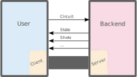
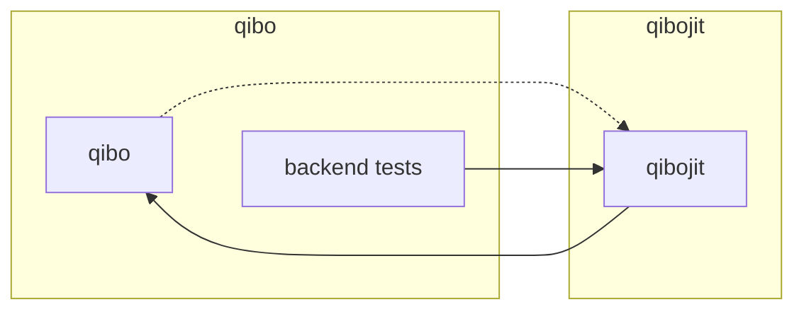

# Qibo-core

Bootstrap meeting

---

# Motivation

- <simple-icons-dependabot/> dependencies

<center>

</center>

<em font-size-sm c-slate>[(not to mention tests)]()</em>

- <ion-language/> multi-language support

<center>

<em v-mark.highlight.blue>what if my backend were written in C++?</em>

*and if I wanted to use Qibo in Rust?*

</center>

- <mdi-rate-review/> <span v-mark.cross.red>review fundamentals</span>


---

# Gate

<div grid="~ cols-2" gap-lg>

<div>

Currently, gates are bringing a lot of information:

```py
        self.name = None
        self.draw_label = None
        self.is_controlled_by = False
        # args for creating gate
        self.init_args = []
        self.init_kwargs = {}

        self.unitary = False
        self._target_qubits = ()
        self._control_qubits = ()
        self._parameters = ()
        config.ALLOW_SWITCHERS = False

        self.symbolic_parameters = {}

        # for distributed circuits
        self.device_gates = set()
        self.original_gate = None
```

</div>

<div flex="~ col justify-between">

<div>

Though many are often left to the default
```py
class H(Gate):
    def __init__(self, q):
        super().__init__()
        self.name = "h"
        self.draw_label = "H"
        self.target_qubits = (q,)
        self.init_args = [q]
        self.unitary = True
```

</div>

<em v-mark.highlight.blue>...but do we really need all this information to be in the gate?</em>
</div>

</div>

---

# Gate

An alternative approach

<br/>

Gates have no intrinsic meaning on their own, but rather represent an <span
v-mark.red>abstract instructions</span> for an interpreter: the <span
v-mark.red>backend</span>.

<center>

```rs
q0: ─H─U1─U1─U1─U1───────────────────────────x───
q1: ───o──|──|──|──H─U1─U1─U1────────────────|─x─
q2: ──────o──|──|────o──|──|──H─U1─U1────────|─|─
q3: ─────────o──|───────o──|────o──|──H─U1───|─x─
q4: ────────────o──────────o───────o────o──H─x───
```

</center>

<br m-5/>

Thus, we could just treat them as markers, instead of full-blown objects.

<p align="right" text-xs line-height-none italic v-mark.bracket.orange>
It is sufficient that gate properties are known to the library, not to the object
  itself.<br/>
We will need functions able to retrieve the desired property given the marker, but this
  is usually pretty simple.
</p>

---

# Circuit

As specialized graphs

<div flex="~ row justify-around">

```rs
pub struct Circuit {
    /// Set of gates
    gates: Vec<Gate>,
    /// Gates connectivity
    edges: Vec<Edge>,
    /// Current final gates of each wire
    ends: Vec<Option<Node>>,
}
```

</div>

And reconstruct the other properties

<div flex="~ row justify-around">

```rs
impl Circuit {
    /// Reconstruct the sequence of gates in the given wire.
    pub fn wire(&self, element: usize) -> Vec<Gate> { ... }
    /// Determine the elements the specified gate is acting on.
    pub fn elements(&self, gid: usize) -> Vec<usize> { ... }
    /// ...
}
```

</div>

---

# Backend

As independent processes

<br m-2/>

<div flex="~ row justify-around">



</div>

---
layout: center
---

# Optimization

<br>

To pass heavy objects, alternative mechanism could be constructed

- share memory between process
- pass a pointer to memory on a discrete device

Moreover, we could consider spawning backends as threads, instead of processes.

---
layout: center
---

# Thanks :)

---

# Dependencies

Including tests

<center>

</center>
