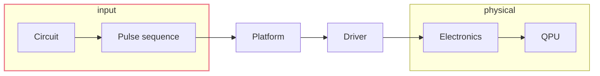
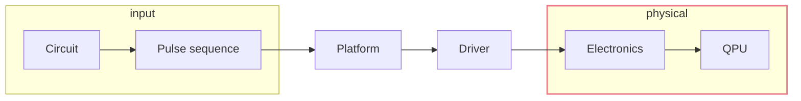
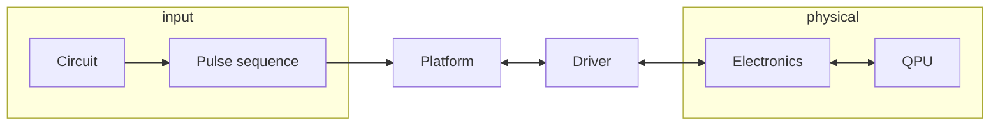

<h1 c="white" bg-stone-900 rd-8 border="2 white">Qibolab & Qibocal</h1>

<p c="white">Quantum middleware</p>

<div absolute bottom-5 w="80%" m-x-5 flex="~ justify-between">
<p c-white italic>Alessandro Candido</p>

<div m-1 flex="~ row" p-2 gap-sm bg-gray-200 rounded>


</div>
</div>

---
transition: abrupt
---

# Qibolab <cite-arxiv aref="2308.06313" text-sm/>

<div w="full children:90%" flex="~ justify-center row" >



</div>

<div grid="~ cols-2 rows-3" h="65%" gap-sm p="sm t-0">
<div row-span-2>

The **<span underline>input</span>** for a computation could be very standard, at the
level of a **circuit**.
That kind of interface is already defined by <span underline>Qibo</span> itself.

However, at a lower level, **pulses** are still a standard-enough way to interact with
hardware, and these are defined by <span underline>Qibolab</span>.

</div>
<div col-start-1>
    Pulse sequence plot (from notebook?)
</div>
<div row-span-3 row-start-1 col-start-2>

```python
def create():
    instrument = DummyInstrument("myinstr", "0.0.0.0:0")

    channels = ChannelMap()
    channels |= Channel(
        "readout", 
        port=instrument.ports("o1")
    )
    ...

    return Platform(
        "myplatform", 
        qubits={qubit.name: qubit}, 
        instruments={instrument.name: instrument},
        ...
    )
```

</div>
</div>

---
transition: abrupt
---

# Qibolab - Drivers

<div w="full children:90%" flex="~ justify-center row" >



</div>

<div grid="~ cols-5" gap-sm p="sm" m-t-5>
<div flex="~ col justify-center items-center" m-t--10>
<div p="sm x-2xl" rounded bg="slate-200 dark:slate-800">

- [Qblox](https://www.qblox.com/)
- [Zurich](https://www.zhinst.com/)
- [QM](https://www.quantum-machines.co/)
- [QICK](https://github.com/openquantumhardware/qick)

</div>
</div>
<div col-span-4>

```sh
      move      1,R0        # Start at marker output channel 0 (move 1 into R0)
      nop                   # Wait a cycle for R0 to be available.

loop: set_mrk   R0          # Set marker output channels to R0
      upd_param 1000        # Update marker output channels and wait 1μs.
      asl       R0,1,R0     # Move to next marker output channel (left-shift R0).
      nop                   # Wait a cycle for R0 to be available.
      jlt       R0,16,@loop # Loop until all 4 marker output channels have been set once.

      set_mrk   0           # Reset marker output channels.
      upd_param 4           # Update marker output channels.
      stop                  # Stop sequencer.
```

<div m-t--10 z-2 relative>
<p text-right italic m-r-20>

by
[Qblox](https://qblox-qblox-instruments.readthedocs-hosted.com/en/master/cluster/q1_sequence_processor.html#example)

</p>
</div>

</div>
</div>

---

# Qibosoq - Server on QICK <cite-arxiv aref="2310.05851" text-sm/>


<div w="full children:90%" flex="~ justify-center row" >
<div flex="~ col">



<div m="t--1" text-xs italic>
Qibolab handles the whole connection, and takes care of fetching the single or multiple results.
</div>
</div>
</div>

<div m-lg grid="~ cols-2" gap-sm>
<div flex="~ col justify-center">

For the single open source platform <span v="top" text-xs italic style="font-variant: small-caps">FPGA
firmware</span> currently in Qibolab, there has been a dedicate effort to define a
suitable server, to optimize the communication with the board.

<p text-right>
&xrarr; Qibosoq
</p>

</div>
<div flex="~ col items-center">
  
</div>
</div>

<p absolute bottom--3 left-10 text-sm italic>

in collaboration with **INFN-UNIMIB-BIQUTE**

</p>

---

# [Platform dashboard](http://login.qrccluster.com:10000/)

<div h-full p-lg flex="~ col justify-center" gap="lg" class="children:(w-full p-lg rounded-lg bg-#111217)">
  
  
</div>

---

# Qibocal


<div flex="~ justify-center" h="full">
  
</div>

---

# Qibocal

A runcard

<div m-lg grid="~ cols-2" gap-sm>
<div flex="~ col">


```yaml
backend: qibolab
# for the time being, the backend has to be qibolab
platform: iqm5q
# this has to match the platform definition, examples at
# https://github.com/qiboteam/qibolab_platforms_qrc/
qubits:
- 0
# you could target multiple qubits at the same time

actions:
- id: qubit spectroscopy 01
  operation: qubit_spectroscopy
  parameters:
    drive_amplitude: 0.5
    drive_duration: 4000
    freq_step: 1000000
    freq_width: 100000000
    nshots: 1024
    relaxation_time: 5000
  qubits: []
  update: true
```


</div>
<div flex="~ col items-center" m="t--32">

```yaml
- id: qubit spectroscopy 02
  operation: qubit_spectroscopy_ef
  parameters:
    # ...
  qubits: []
  update: true
- id: rabi
  operation: rabi_amplitude_signal
  parameters:
    # ...
  qubits: []
  update: true
- id: rabi ef
  operation: rabi_amplitude_ef
  parameters:
    # ...
  qubits: []
  update: true
- id: qutrit
  operation: qutrit_classification
  parameters:
    # the parameters could be an arbitrary object but
    # the layout is defined by the operation
    classifiers_list:
    - decision_tree
    nshots: 5000
    relaxation_time: 5000
  qubits: []
  update: true
```

</div>
</div>


<!-- --- -->
<!-- layout: none -->
<!-- --- -->
<!---->
<!-- <div z--2 absolute="~" h="full" w="full" flex="~ justify-center items-center"> -->
<!---->
<!-- # [Qibocal reports](http://login.qrccluster.com:9000) -->
<!---->
<!-- </div> -->
<!---->
<!-- <iframe src="http://login.qrccluster.com:9000/" h="200%" w="200%" scale="50" translate="x--120 y--70"/> -->

---
layout: none
---


---
layout: none
---


---

# Docs

The previous runcard was admittedly taken from an old example...

<br m="b-5"/>

While the layout is still similar, Qibolab and Qibocal are evolving over time*. 

The best way to learn and stay up-to-date with the development is reading the official
docs:

- https://qibo.science/
- https://qibo.science/qibolab/stable/
- https://qibo.science/qibocal/stable/

<br m="b-10"/>

*All versions are anyhow available on [GitHub
releases](https://github.com/qiboteam/qibocal/releases) and
[PyPI](https://pypi.org/project/qibocal/#history)

---
layout: center
---

# Thanks
