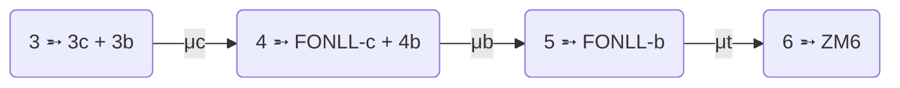

# Deep Inelastic Scattering

Lepton-hadron scattering

  <bkg-img src="theory/dis-diagram.svg" p="6" w="xs"/>

The ideal process to probe PDFs: a point-like particle scanning the composite
one.

---
src: ./dis/dimensions.html
---

---
src: ./dis/available.html
---

---

# [Yadism](https://github.com/NNPDF/yadism)

Yet another DIS module 

  <bkg-img src="theory/yadism.png" w="80" p="1"/>

There were already mainly two available DIS providers:
[*APFEL*](https://github.com/scarrazza/apfel/) and
[*QCDNUM*](https://www.nikhef.nl/~h24/qcdnum/).

But we needed:

<ul>
 <li>integration in the <b><Link to="17">pineline</Link></b></li>
 <ul>
    <li>produce PineAPPL grids</li>
    <li>registered PineFarm provider</li>
 </ul>
 <li>curated <a href="https://yadism.readthedocs.io/">docs</a></li>
 <li>improved maintainability (more modular, organic design, CI/CD, packaging
 and distribution)</li>
</ul>

- an improved/rechecked **scale variations** implementation
- **new analytical** components
  - intrinsic NLO CC
  - improved heavy NNLO NC
  - heavy NNLO CC *(yet to come)*
- re-examine **FNSs**
- **more TMC** options
- extended and automated **benchmarks**

Yadism is also a <b>[coefficients
database](https://github.com/NNPDF/yadism/tree/master/src/yadism/coefficient_functions)</b>:
they are implemented in such a way to be directly used by 3rd
parties!

---

# FONLL status

  <cite-arxiv aref="1001.2312" right="0" class="relative"/>

$$
F_{FONLL}(Q^2) = F^{(n)}(m_q) - F^{(n,0)}(m_q) + F^{(n+1)}
$$

This GM-VFNS is matching two calculations: 
- one done in $n$ flavors scheme, accounting for **mass effects**
- another in $n+1$ scheme, <b>resumming collinear logs</b>

To use PDFs in a single scheme, $f^{(n+1)}$, matching conditions (and an
entire <Link to="13">EKO</Link>) are encoded in the coeffs, $B^{(n)}$.

For consistency, Yadism at the moment implements **FONLL with one mass** at a time:

Lifting the limitation of using PDFs in a single scheme, FONLL can be
directly [implemented at the observable
level](https://github.com/NNPDF/yadism/issues/166), including **consistently many
different mass effects differences**: $F^{(d,n)} = F^{(n)} - F^{(n,0)}$

$$
F_{FONLL}(m_c, m_b) = F^{(d,3)}(m_c) + F^{(d,4)}(m_b) + F^{(5)}
$$

