# DGLAP evolution

Define PDFs dependency on unphysical scale $\mu_F$

$$
  \mu^2 \frac{\text{d}{\textbf{f}}}{\text{d}\mu^2}(\mu^2) = \textbf{P} (a_s(\mu^2),\mu^2) \otimes \textbf{f}(\mu^2)
$$

 

These equations define a set of **linear operators** $\textbf{E}(\mu^2 \leftarrow
\mu_0^2)$ **on PDF** sets:

$$
  \textbf{f}(\mu^2) = \textbf{E}(\mu^2 \leftarrow \mu_0^2) \otimes \textbf{f}(\mu_0^2)
$$

  <bkg-img src="theory/ev-op.svg" p="6" w="md"/>

---

# [EKO](https://github.com/NNPDF/eko)

Evolutionary Kernel Operator

  <cite-arxiv aref="2202.02338" right="0" class="relative"/>

  <bkg-img src="theory/eko.png" p="2" w="1/5"/>

The main goal of EKO is to compute **reusable evolution operators** (i.e. EKOs).

```mermaid
flowchart LR
  rc("runcard 📄") -- "run 🦓" --> eko("EKO 📦")
```

It does so, by solving DGLAP equations in $N$-space, but providing an $x$-space
output for compatibility with existing PDF sets.

  <bkg-img src="theory/mellin.svg" p="4" w="lg"/>

---

# Original features

  
    <Link to="17">Pineline</Link> integration
  

- Intrinsic evolution

  <bkg-img src="theory/intrinsic.svg" p="4" w="xs"/>

- Full backward VFNS (including intrinsic)

  <bkg-img src="theory/back-vfns.svg" p="4" w="sm"/>

---

# ... and more to come

More than anything else, EKO is an evolution **framework**, still rapidly
growing collecting many contributions, from new and existing applications.

The goal is to have all of them in a single place, for anyone interested in
solving DGLAP.

- storage
- distributed computation
- $N$ space
  [expressions](https://github.com/NNPDF/eko/tree/split-math-in-module/src/ekore) [database](https://github.com/NNPDF/eko/issues/185)
- curated [docs](https://eko.readthedocs.io/)
- improved maintainability (more modular, organic design, CI/CD, packaging
 and distribution)

- Factorization scale vars 
  - first truly expanded
  - full *resummation* scales <cite-arxiv aref="2205.15900" right="0" class="relative"/>
- QED implementation
  - up to NLO QCD-QED and NNLO QED
  - fixed (non-running) QED coupling
- $N^3LO$ evolution and matching
  - *in-house* splitting functions
- Polarized evolution
- Time-like evolution

Of course, everything on top of reimplemented features: up to NNLO evolution and
matching, EXA/EXP/TRN (and more flexible variations), $\alpha_s$ evolution,
interpolation, ...

