# Intrinsic Charm

  <a href="https://www.quantamagazine.org/inside-the-proton-the-most-complicated-thing-imaginable-20221019/" b="!none">
    <bkg-img dark src="protons/quanta.webp" p="6" w="xl" rounded="20"/>
  </a>

---
layout: cols
---

# Charm in the proton

Heavier but there

  <cite-arxiv aref="2208.08372" right="0" class="relative"/>

<template #col-1>

A **charm component** in the proton is not a novelty, since it is generated
perturbatively by DGLAP evolution, in a FNS with 4 flavors or more (by gluon
splitting).

But it is possible to also have a charm of different origin

- **perturbative**: DGLAP generated
- **intrinsic**: generated by non-perturbative dynamics
- **fitted**: the component arising in the boundary condition from the fit

</template>
<template #col-2>

  <video autoplay loop muted w="4/5" h="2/3" p="2" rounded="4"
    bg="black" shadow="~ dark">
    <source src="/protons/split.mp4" type="video/mp4">
  </video>

The <b>NNPDF4.0</b> charm component it is not directly *intrinsic*, since the
fit is done in the 4FNS.

</template>

---
layout: cols
---

# Unveiling the intrinsic component

```mermaid
flowchart TD
  data <-..-> fit
  fit -- "Matching: 4FNS ➤ 3FNS\n @ NNLO or N3LO" --> intrinsic

  data("Experimental data and predictions")
  fit("NNPDF4.0 parametrization in 4FNS")
  style fit stroke:#65a30d
  intrinsic("3FNS PDFs: including <strong><em>scale-independent</em> intrinsic
  charm component</strong>
  <em style='font-size: 0.8em'>PDF and MHO uncertainties</em>")
  style intrinsic stroke:#e11d48
  classDef hl stroke-width:2px
  class intrinsic,fit hl
```

<template #col-1>

</template>
<template #col-2>

The **Operator Matrix Element (OME)** $\mathbf{A}^{(n_f)}(\mu_{h}^2)$ is
partially known up to N$^3$LO.

  <bkg-img src="intrinsic/vfns-details.svg" p="6" w="xs"/>

**Inverse operator** (the OME can be inverted either *perturbatively* or *numerically*)

  <bkg-img src="intrinsic/vfns-back-details.svg" p="6" w="xs"/>

</template>

<template #after>

$$
\mathbf{f}^{(n_f+1)}(\mu_{F,1}^2) =
  \left[\mathbf{E}^{(n_f+1)}(\mu_{F,1}^2\leftarrow \mu_{h}^2)
        {\mathbf{R}^{(n_f)}}
        \mathbf{A}^{(n_f)}(\mu_{h}^2)
\mathbf{E}^{(n_f)}(\mu_{h}^2\leftarrow \mu_{F,0}^2) \right]\\
        \times \mathbf{f}^{(n_f)}(\mu_{F,0}^2)
$$

</template>

---

# Evidence

  <bkg-img src="intrinsic/3fns_Quad_MHOU.svg" p="2" w="sm" 
    hover="scale-150" transition="all 1000"/>

In <b>3FNS</b> a <b>valence-like peak</b> is present.
- for $x \leq 0.2$ the **perturbative uncertainties** are quite large
- the carried **momentum fraction** is within **1%**

---
layout: cols
---

# Predictions and stability

<template #col-1>

  <bkg-img src="intrinsic/lhcb-zcharm-pheno.svg" p="6" w="xs"/>

The intrinsic charm fit produces <b>better predictions</b> for some
charm-sensitive datasets, *not included in the fit*.

</template>
<template #col-2>

The <b>evidence is stable</b> under dataset variations, *including*
charm-sensitive datasets.

  <bkg-img src="intrinsic/pull_baseline_EMC_LHCb_Zc.svg" p="6" w="xs"/>

</template>
