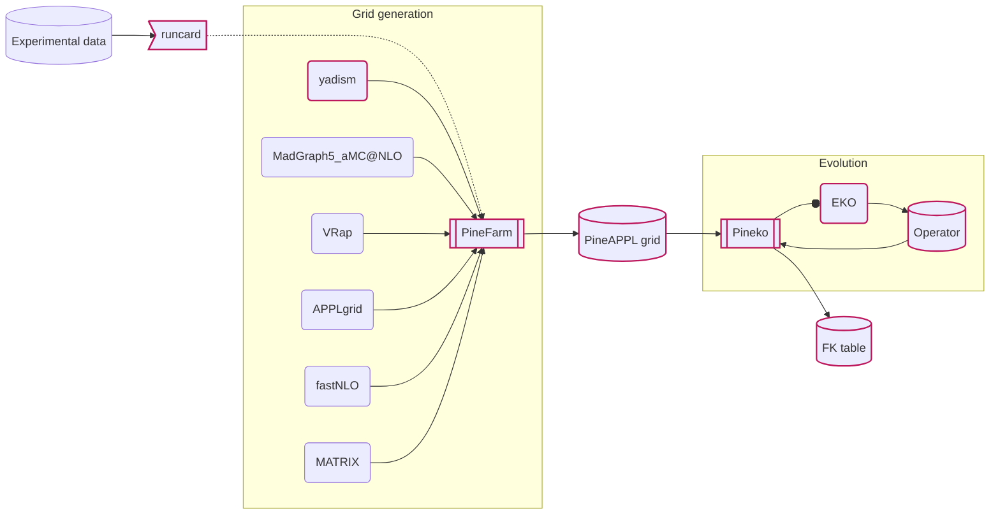

# [PineAPPL](https://github.com/NNPDF/pineappl)

PineAPPL Is Not an Extension of APPL

  <cite-arxiv aref="2008.12789" right="0" class="relative"/>

This is an **interpolation grids** format, mainly designed and developed by
[Christopher Schwan](https://github.com/cschwan).

We decide to adopt as the base interface between the different building blocks
for the whole theory predictions infrastructure.

In order to this, it ships:

- a performant [Rust library](https://github.com/NNPDF/pineappl/tree/master/pineappl)
  - maintaining a dedicated <b>file format</b>
- a versatile [CLI](https://github.com/NNPDF/pineappl/tree/master/pineappl_cli)
  - for **quick inspection** and **frequent tasks** execution, e.g.:
  - convolution, conversion, optimization, pull calculation, plotting, ..
- [Python bindings](https://github.com/NNPDF/pineappl/tree/master/pineappl_py)
  - powering the **integration with the theory pineline**
- [C](https://github.com/NNPDF/pineappl/tree/master/pineappl_capi)/[C++](https://github.com/NNPDF/pineappl/blob/master/examples/object-oriented-cpp/PineAPPL.hpp)/[Fortran](https://github.com/NNPDF/pineappl/blob/master/examples/fortran/pineappl.f90) interface
  - for direct grid filling by **MC generators**
- **converters** from other common formats ([APPLgrid](https://github.com/NNPDF/pineappl/tree/master/pineappl_applgrid), [fastNLO](https://github.com/NNPDF/pineappl/tree/master/pineappl_fastnlo))

---

# [Pineline](https://nnpdf.github.io/pineline/)

Industrialized theory predictions

  <cite-arxiv aref="2211.10447" right="0" class="relative"/>

Special focus on reproducibility.
