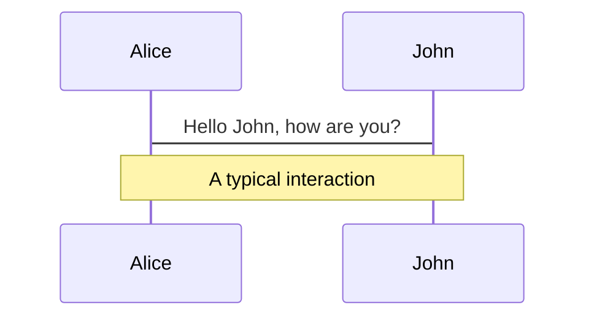
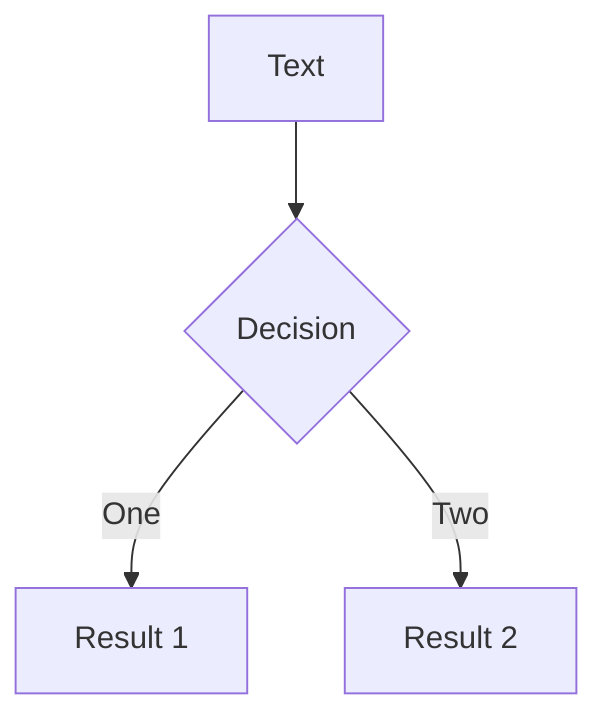
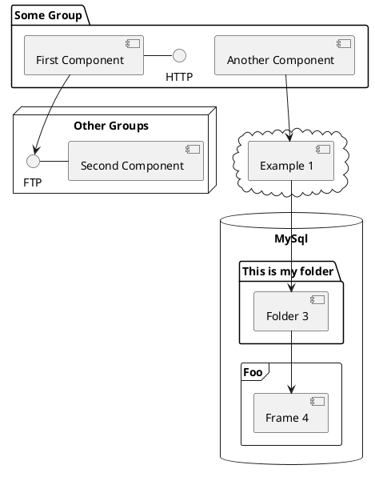

---
# try also 'default' to start simple
theme: default
# random image from a curated Unsplash collection by Anthony
# like them? see https://unsplash.com/collections/94734566/slidev
# apply any windi css classes to the current slide
highlighter: shiki
lineNumbers: false
info: |
  ## PhD Thesis
  Slides for the PhD Thesis Defense of Alessandro Candido.

  More at [phd.annibale.dev](https://phd.annibale.dev)
# persist drawings in exports and build
drawings:
  persist: false
# use UnoCSS
css: unocss
src: pages/cover.html
background: amenities/IMG20210709133314-1024x768.jpg
class: "text-center p-0"
---

---
layout: image-right
image: protons/042917_proton_main.jpg
---

# Contents

<div style="height: 2rem"/>

1. introduction
2. theory
    - DIS
    - evolution
    - pipeline
3. methodology
4. applications

<style>
  li {
    line-height: 3rem !important;
  }
  li li {
    line-height: 2rem !important;
  }
</style>


---

# NNPDF 4.0
<div w="full" flex="~" justify="end">
  <cite-arxiv aref="2109.02653" right="0" class="relative"/>
</div>

<div grid="~ cols-2 gap-8" m="8 t-4 y-12">
  <bkg-img src="pdfs/40-q3.svg" p="x-6"/>
  <bkg-img src="pdfs/40-q100.svg" p="x-6"/>
</div>

To get to a full PDF set many ingredients are required...

---

<div w="full" flex="~" justify="center" items="center">
  <bkg-img src="organization.png" w="150" p="8"/>
</div>

---
layout: section
---

# Theory predictions


---
class: px-20
---

# Themes

Slidev comes with powerful theming support. Themes can provide styles, layouts, components, or even configurations for tools. Switching between themes by just **one edit** in your frontmatter:

<div grid="~ cols-2 gap-2" m="-t-2">

```yaml
---
theme: default
---
```

```yaml
---
theme: seriph
---
```


</div>

Read more about [How to use a theme](https://sli.dev/themes/use.html) and
check out the [Awesome Themes Gallery](https://sli.dev/themes/gallery.html).

---
preload: false
---

# Animations

Animations are powered by [@vueuse/motion](https://motion.vueuse.org/).

```html
<div v-motion :initial="{ x: -80 }" :enter="{ x: 0 }">Slidev</div>
```

<div class="w-60 relative mt-6">
  <div class="relative w-40 h-40">
    
    
    
  </div>

  <div
    class="text-5xl absolute top-14 left-40 text-[#2B90B6] -z-1"
    v-motion
    :initial="{ x: -80, opacity: 0}"
    :enter="{ x: 0, opacity: 1, transition: { delay: 2000, duration: 1000 } }">
    Slidev
  </div>
</div>

<!-- vue script setup scripts can be directly used in markdown, and will only affects current page -->
<script setup lang="ts">
const final = {
  x: 0,
  y: 0,
  rotate: 0,
  scale: 1,
  transition: {
    type: 'spring',
    damping: 10,
    stiffness: 20,
    mass: 2
  }
}
</script>

<div
  v-motion
  :initial="{ x:35, y: 40, opacity: 0}"
  :enter="{ y: 0, opacity: 1, transition: { delay: 3500 } }">

[Learn More](https://sli.dev/guide/animations.html#motion)

</div>

---

# LaTeX

LaTeX is supported out-of-box powered by [KaTeX](https://katex.org/).

<br>

Inline $\sqrt{3x-1}+(1+x)^2$

Block

$$
\begin{array}{c}

\nabla \times \vec{\mathbf{B}} -\, \frac1c\, \frac{\partial\vec{\mathbf{E}}}{\partial t} &
= \frac{4\pi}{c}\vec{\mathbf{j}}    \nabla \cdot \vec{\mathbf{E}} & = 4 \pi \rho \\

\nabla \times \vec{\mathbf{E}}\, +\, \frac1c\, \frac{\partial\vec{\mathbf{B}}}{\partial t} & = \vec{\mathbf{0}} \\

\nabla \cdot \vec{\mathbf{B}} & = 0

\end{array}
$$

<br>

[Learn more](https://sli.dev/guide/syntax#latex)

---

# Diagrams

You can create diagrams / graphs from textual descriptions, directly in your Markdown.

<div class="grid grid-cols-3 gap-10 pt-4 -mb-6">







</div>

[Learn More](https://sli.dev/guide/syntax.html#diagrams)
